# Explorations on creating lead type from SVG shapes

A notebook about trying to find a silver bullet to automate a tedious manual process.  
After a bit of manual work, I decided to automate this process. It turns out that this process was absolutely non-trivial, and that I'd better develop a strict framework and guidelines around doing it manually.

A first manual attempt
----------------------

### How does a lead character look ?

A bit of context is needed on what I'm trying to attain. I'd like to be able to be self-sufficient on the production of lead-like movable characters and shapes.

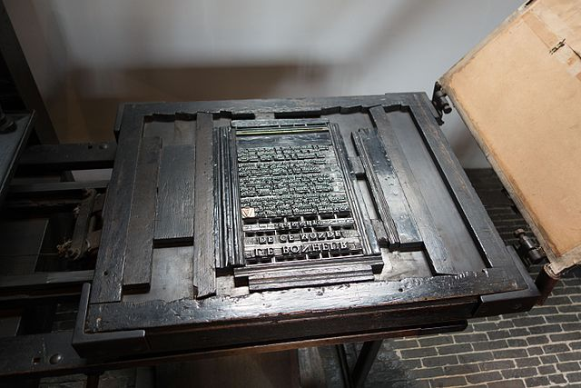This image was originally posted to Flickr by quinet at https://flickr.com/photos/91994044@N00/25792503796.

In Toulouse, the place I live in southwestern France, some workshops offer their CNC machining services and are able to produce aluminum plates at the correct height for a typographic press. But I'd like a typographic press to become an experimentable tool, rather than a final process, marked by the need to be absolutely certain of a layout before sending it to be engraved.

A distinct, but crucial feature of engraved aluminum plates or lead type was that the shape to be printed wasn't just extruded out of its substrate. The shape emerges of a pillar similar to an offset of its outline. On the figure below, you can see this slight offset. Extruding a shape is obviously simple, but this gives strength to the character.

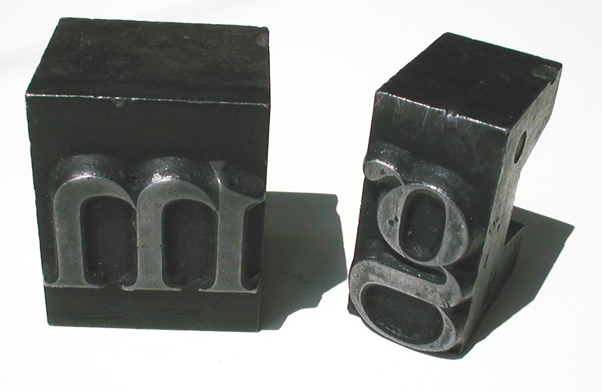Free picture by https://fr.freeimages.com/photo/lead-type-1-1460305

### How can we reproduce this slope manually ?

Even more crucially, if I'm headed towards lost PLA aluminum casting with 3D printed counterforms, meaning another bee's nest, I'll start by using plastic characters to print. After some failed attempts years ago, they failed under pressure if the shape of the letter wasn't strengthened by this light slope.

This slope is quite tedious to generate manually : I start from path data from Inkscape or Illustrator, import it into Blender, extrude it, offset it with Offset Scale (Alt + S), intersect it with a regular cube to suppress distorsion from Offset Scale, export it to a STL file, clean it in Netfabb, and then slice it in Cura.

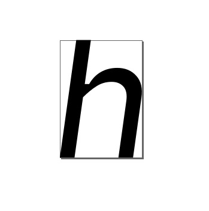"h" bold italic in Input from FontBureau, in Inkscape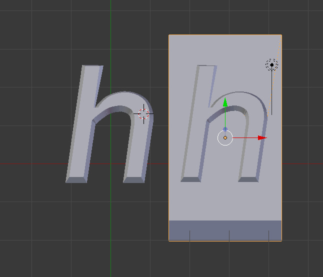after an import and offset extrusion in Blender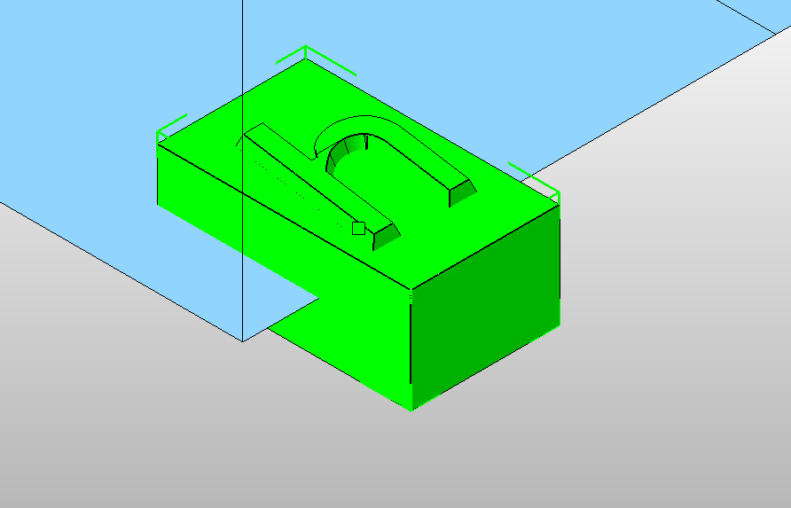then imported into Netfabb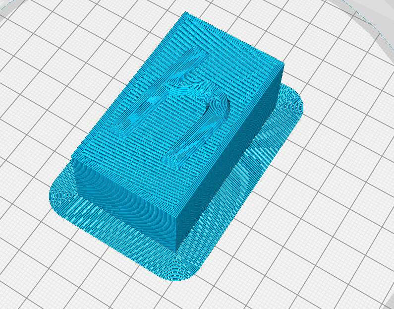and finally sliced in Cura

This process is tedious. I thought I could automate it, starting from SVG path data. The rest of this page shows how this was way more complex than I thought, and, after a week of exploration, it's obvious I should have thought of intersecting paths, paths with holes, concave shapes, and a lot more traps.

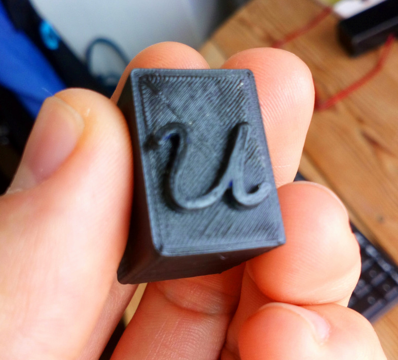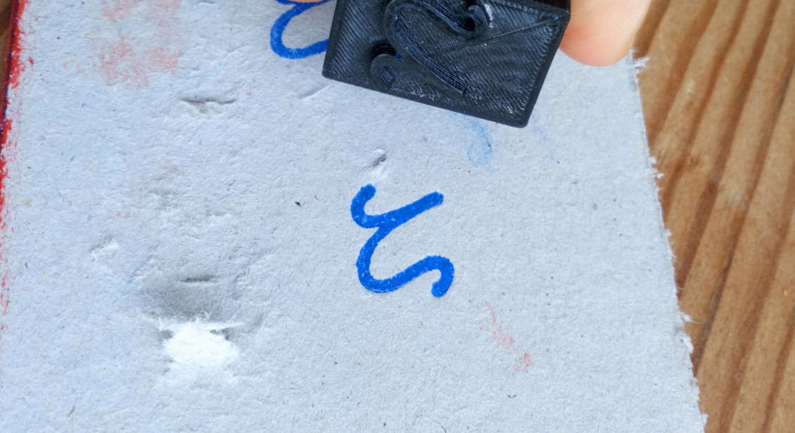

Creating a lead type 3D model with its slope, from raw SVG path data.
---------------------------------------------------------------------

### SVG path data structure

Here's a box containing an outlined "h" in Vulf Mono Light Italic, a typeface by Oh No type company. We'll try to understand how this list of instructions work.

    <path style="stroke:#130000;stroke-opacity:1;stroke-width:4.42498882;stroke-miterlimit:4;stroke-dasharray:none;paint-order:markers stroke fill;fill:#ff0000;fill-opacity:1"
    d="m 205.47289,169.14572 c -1.08,0 -1.56,-0.6 -1.56,-1.64 0,-3.4 4.68,-7.48 4.68,-12.04 0,-3 -1.88,-4.52 -4.84,-4.52 -3.52,0 -6.96,1.48 -10.4,7.2 h -0.56 c 2.08,-4.8 3.48,-8.48 3.48,-11.48 0,-2.24 -1.28,-3.36 -3.52,-3.36 -1.52,0 -3.12,0.44 -4.8,1.12 0.36,0.68 0.64,1.44 0.84,2.08 1.48,-0.68 2.48,-1.04 3.64,-1.04 1.28,0 1.84,0.6 1.84,1.76 0,2.92 -3.32,10.88 -8,23.16 0.8,0.12 1.44,0.24 2,0.48 l 0.12,0.04 c 5.68,-15.48 11.24,-18 14.92,-18 1.88,0 3.04,0.8 3.04,2.72 0,3.52 -4.68,7.64 -4.68,11.96 0,2.44 1.64,3.52 3.48,3.52 2.48,0 4.04,-1.56 6.08,-4.2 -0.72,-0.48 -1.12,-0.8 -1.68,-1.28 -1.4,2.28 -2.52,3.52 -4.08,3.52 z"
    id="path1702" />

According to [the SVG Pocket Guide](http://svgpocketguide.com/book/#section-2), the "d" attribute contains instructions with mnemonics and values. We'll also keep the SVG Stroke spec in a tab, because an implementation of a stroke algorithm is outlined. [W3 SVG spec](https://www.w3.org/TR/svg-strokes/#SpecifyingStrokePaint)

mnemonic

meaning

observations

m or M

move to

akin to a pen lift. a path must start with a M command.

z or Z

close path

closes the current subpath. draws a straight line between that point and the initial point of the subpath. If a M instruction follows, the next subpath starts at the newly-defined coordinate. Else, the next subpath starts at the same point.

L or l

draw

draws a line from the current point to the next point. The new point becomes the current point. **L** means that following positions are absolute, **l** means relative.

H or h

draw an horizontal line

Akin to L,l H and h denote absolute and relative positioning.

V or v

draw a vertical line

Akin to L,l and H,h, V and v denote absolute and relative positioning.

C or c

Draw a cubic Bézier curve

Draw a curve from the current point, using (x1,y1) as the first control point, and (x2, y2) as the second control point. The same uppercase/lowercase to absolute/relative mapping is effective.

S or s

Draw a cubic Bézier curve, with reflection

Draw a curve following a C statement, with tensor points mirrored.

Q or q

Draw a quadratic Bézier curve

Quadratic Bézier curves have a single (x1, y1) tensor.

T and t

Draw a quadratic Bézier curve

Akin to S and s following a cubic Bézier curve, T and t are mirroring statements for a quadratic Bézier curve.

A and a

Draw a segment of an ellipse.

A statements draw a segment of an ellipse, given a start point, end point, x radius, y radius, rotation of the ellipse, and direction. Two additional parameters, large-arc and sweep, are flags giving directions on which part of the ellipse should be drawn.

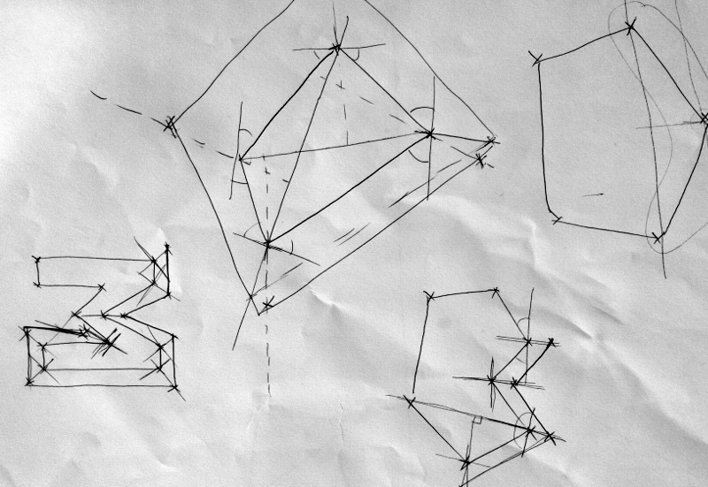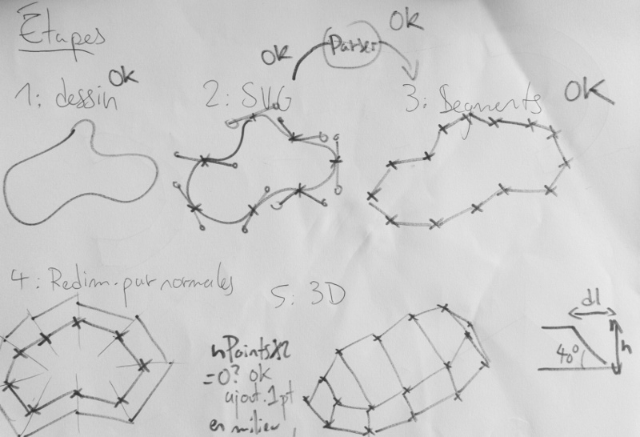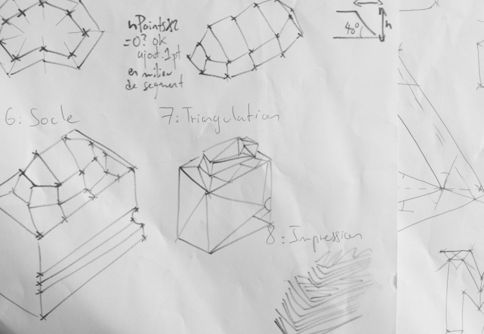early sketches of the process as I imagined it

With those elements in mind, we can decipher the above svg path, and annotate it :

    m 205.47289,169.14572 // Move to (205.47289, 169.14572)
    c -1.08,0 -1.56,-0.6 -1.56,-1.64 // Cubic Bézier (relative, from last point, first tensor at (-1.08, 0), second tensor at (-1.56, -0.9), end point at (-1.56, -1.64))

### Introducing a clearer notation for our research

This notation is a bit hard to read, so we'll introduce "functions", that return the current point. Points will be a kind of tuples (x, y).

    m 205.47289,169.14572 // move((205.47289, 169.14572))
    c -1.08,0 -1.56,-0.6 -1.56,-1.64 // cubicRel(lp, (-1.08,0), (-1.56,-0.6), (-1.56,-1.64))

We can see a pattern emerging : a dependency on a global "current point" state. To write a parser/an interpreter, this isn't too uncommon. We could also think of this in a functional way, and use referential transparency at our advantage :

    m 205.47289,169.14572 // move((205.47289, 169.14572)) -> returns ((205.47289, 169.14572))

The last sample with two instructions becomes :

    cubicRel((-1.08,0), (-1.56,-0.6), (-1.56,-1.64))

If we introduce the following instruction in the original path, another cubic Bézier curve, our path now looks like :

    cubicRel(
    cubicRel(
      move((205.47289, 169.14572)),
      (-1.08,0), (-1.56,-0.6), (-1.56,-1.64))
     , (0,-3.4), (4.68,-7.48), (4.68,-12.04))

Well. As much as I like lisps, maybe a parser with a global state will be enough. I only aim to parse svg paths, so the table defined earlier on will be enough to guide us. Maybe, even, we could just avoid a global state and produce a list of instructions taking the last point as an argument, and reevaluating everything to absolute coordinates.

    move((205.47289, 169.14572)) // -> (205.47289, 169.14572)
    cubicRel((205.47289, 169.14572),
     (204,39289, 169.14572),
     (203,91289, 168,54572),
     (203,91289, 167,50572)) // -> (203,91289, 167,50572)

This seems quite easy to generate ! Let's write the minimal amount of code to parse those two declarations to an AST, and produce this kind of pseudo-instruction list. I'm writing all of this in a html document, so I'll write in JS to get live examples quick and running.

### Parsing SVG path data to an AST with a reduced grammar

Let's start by drafting a grammar allowing those two instructions to exist. This syntax and prose is vague compared to a real grammar description language, and the SVG spec contains a backus-naur form of the SVG grammar.  
But it should read :

*   a _path_ is made of _instructions_.
*   _instructions_ can be _move_ or _cubic_.
*   _instructions_ take a various number of _points_.
*   a _point_ is made of two _numbers_ separated by a comma, between parentheses.
*   a _number_ is an optional hyphen, followed by multiple _digits_, an optional dot, and maybe multiple _digits_ again
*   finally, a _digit_ is any character in \[0 1 2 3 4 5 6 7 8 9\]

    path = instructions*
    instruction = move point | cubic point point point point
    point = '('number','number')'
    number = '-'?digit+'.'?digit+
    digit = [0-9]

This is enough to write a basic parser that understands standalone _move_ and _cubic_ instructions.

    [
      {
        "type": "Move",
        "params": [
          {
            "x": "205.47289",
            "y": "169.14572"
          }
        ]
      },
      {
        "type": "Cubic",
        "params": [
          {
            "x": "-1.08",
            "y": "0"
          },
          {
            "x": "-1.56",
            "y": "-0.6"
          },
          {
            "x": "-1.56",
            "y": "-1.64"
          }
        ]
      }
    ]

This live example uses the following JS implementation : we have a regex to identify points, and define regexes for move and cubic instructions. We only tokenize the input by splitting at newlines, trimming the resulting lines, and filtering empty ones.

    const Point = function(x, y) { this.x = x; this.y = y; };
    const pointR = '(?:([-]*\\d+\\.?(?:\\d+)?),([-]*\\d+\\.?(?:\\d+)?))';
    
    const moveRegex = new RegExp(`m\\s*${pointR}`, 'i');
    const cubicRegex = new RegExp(`c\\s*${pointR}\\s${pointR}\\s${pointR}`, 'i');
    
    const matchesToPoints = (token, matches) => {
      if (!matches) throw new Error(`Couldn't parse token ${token}`);
      const points = matches.slice(1);
      if (points.length % 2 !== 0) throw new Error(`Instruction contains an uneven number of coordinates.`);
      const out = [];
      for (let i = 0; i < points.length; i += 2) {
        out.push(new Point(points[i], points[i + 1]));
      }
      return out;
    };
    
    const move = token => matchesToPoints(token, token.match(moveRegex));
    const cubic = token => matchesToPoints(token, token.match(cubicRegex));
    
    const lex = (tokens) => {
      return tokens.map(t => {
        switch (t.charAt(0).toLowerCase()) {
          case "m":
            return {type: 'Move', params: move(t) };
          break;
          case "c":
            return {type: 'Cubic', params: cubic(t) };
          break;
          default:
            return;
          break;
        }
      });
    };
    
    const tokenize = text => text.split('\n').map(a => a.trim()).filter(a => a);
    export const parse = text => lex(tokenize(text));

### Parsing realistic input

Still, we're assuming many things here. We need a list of newline-separated instructions, starting with their mnemonic.The input format is a list of instructions, without newlines, and mnemonics are only present at an instruction change. That means `m point \n c point point point \n c point point point` won't ever be present. We need a way to keep track of the current type of instruction, and take points accordingly.  
Let's do this !

We need to have a kind of state-machine, starting at an undetermined state, and chewing through text obeying rules for the current state, and a list of transitions between states. Here's some pseudo-code defining those principles. We'll write a basic parser that aims to keep track of the current point and generate a list of independent instructions.

We'll also translate all coordinates to absolute by adding the current point's absolute coordinates to every point present in a relative version of an instruction.

    
    States : {"Undefined":0,"Move":1,"Cubic":2,"End":3}
    
    Tokenizing : trim, then split at spaces.
    ["m","205.47289,169.14572","c","-1.08,0","-1.56,-0.6","-1.56,-1.64","0,-3.4","4.68,-7.48","4.68,-12.04"]
    
    Lexing : transform this into a list of instructions.
    [
      {
        "type": "Move",
        "points": [
          {
            "x": 205.47289,
            "y": 169.14572
          }
        ]
      },
      {
        "type": "Cubic",
        "points": [
          {
            "x": 205.47289,
            "y": 169.14572
          },
          {
            "x": 204.39289,
            "y": 169.14572
          },
          {
            "x": 203.91289,
            "y": 168.54572000000002
          },
          {
            "x": 203.91289,
            "y": 167.50572000000003
          }
        ]
      },
      {
        "type": "Cubic",
        "points": [
          {
            "x": 203.91289,
            "y": 167.50572000000003
          },
          {
            "x": 203.91289,
            "y": 164.10572000000002
          },
          {
            "x": 208.59289,
            "y": 160.02572000000004
          },
          {
            "x": 208.59289,
            "y": 155.46572000000003
          }
        ]
      }
    ]
        

The JS code present in this sample, annotated :

    
    // "Enums" for positions and parser state
    export const STATES = fakeEnum('Undefined', 'Move', 'Cubic', 'End');
    const POSITIONS = fakeEnum('Absolute', 'Relative');
    
    // Point string to absolute point, depending on
    // the carried current point and positioning mode
    const strToPt = (str, curr, pos) => {
      const c = curr ? curr : { x:0, y:0 };
      if (!pointReg.test(str)) throw new Error();
      let [expr, x, y] = str.match(pointReg);
      if (pos === POSITIONS.Relative) { x = Number(x) + c.x; y = Number(y) + c.y; };
      return new Point(Number(x), Number(y));
    }
    
    // Move and Cubic AST node generators
    const move = (tokens, index, currentPoint, pos) => {
      const [p1] = [tokens[index]]
        .map(t => strToPt(t, null, pos));
      const instr = { type: 'Move', points: [p1] };
      return { instr, current: instr.points[0] };
    };
    
    const cubic = (tokens, index, currentPoint, pos) => {
      const [p1, p2, p3] = tokens.slice(index, index + 3)
        .map(t => strToPt(t, currentPoint, pos));
      const instr = { type: 'Cubic', points: [currentPoint, p1, p2, p3] };
      return { instr, current: instr.points[3] };
    };
        

The lexing function, carrying state and switches, acts as a transition table :

    
    // For each token, depending on the state we're in, we'll try to parse a point or change state.
    // This is naïve, and will break on invalid input.
    
    const lex = function(tokens) {
      let state = STATES.Undefined;
      let pos = POSITIONS.Absolute;
      let currentPoint = null;
      let instrs = [];
      let i = 0;
      const setPos = (token) => { pos = isUpperCase(token) ? POSITIONS.Absolute : POSITIONS.Relative; };
      while (state !== STATES.End) {
        const token = tokens[i];
        if (state === STATES.Undefined) {
          switch(token.toLowerCase()) {
            case "m":
              state = STATES.Move;
              i += 1;
            break;
            case "c":
              state = STATES.Cubic;
              i += 1;
            break;
          }
          setPos(token);
        } else if (state === STATES.Move) {
          switch(token.toLowerCase()) {
            case "c":
              setPos(token);
              state = STATES.Cubic;
              i += 1;
            break;
            default:
              try {
                let { instr, current } = move(tokens, i, currentPoint, pos);
                instrs.push(instr);
                currentPoint = current;
              } catch(e) {}
              i += 1;
            break;
          }
        } else if (state === STATES.Cubic) {
          switch(token.toLowerCase()) {
            case "m":
              setPos(token);
              state = STATES.Move;
              i += 1;
            break;
            default:
              try {
                let { instr, current } = cubic(tokens, i, currentPoint, pos);
                instrs.push(instr);
                currentPoint = current;
              } catch(e) {}
              i += 3;
            break;
          }
        }
        if (i >= tokens.length -1) state = STATES.End;
      }
      return instrs;
    };
        

### Rendering to a list of expressions & a canvas

Well, it seems to work for those two instructions ! The current point is carried on, and we have independent instructions that are sufficient to render something.

We can try to render it to a list of expressions, akin to an example shown higher, then to a canvas.

    0| move([50,50])
    1| cubic([50,50],[48.92,50],[48.44,49.4],[48.44,48.36])
    2| cubic([48.44,48.36],[48.44,44.96],[53.12,40.879999999999995],[53.12,36.32])
    3| cubic([53.12,36.32],[53.12,33.32],[51.239999999999995,31.8],[48.28,31.8])
    4| cubic([48.28,31.8],[44.76,31.8],[41.32,33.28],[37.88,39])
    5| cubic([37.88,39],[39.96,34.2],[41.36,30.52],[41.36,27.52])
    6| cubic([41.36,27.52],[41.36,25.28],[40.08,24.16],[37.839999999999996,24.16])
    7| cubic([37.839999999999996,24.16],[36.31999999999999,24.16],[34.72,24.6],[33.04,25.28])
    8| cubic([33.04,25.28],[33.4,25.96],[33.68,26.720000000000002],[33.88,27.36])
    9| cubic([33.88,27.36],[35.36,26.68],[36.36,26.32],[37.52,26.32])
    10| cubic([37.52,26.32],[38.800000000000004,26.32],[39.36000000000001,26.92],[39.36000000000001,28.080000000000002])
    11| cubic([39.36000000000001,28.080000000000002],[39.36000000000001,31],[36.040000000000006,38.96],[31.360000000000007,51.24])
    12| cubic([31.360000000000007,51.24],[32.160000000000004,51.36],[32.800000000000004,51.480000000000004],[33.36000000000001,51.72])
    13| cubic([33.36000000000001,51.72],[39.040000000000006,36.239999999999995],[44.60000000000001,33.72],[48.28000000000001,33.72])
    14| cubic([48.28000000000001,33.72],[50.16000000000001,33.72],[51.32000000000001,34.519999999999996],[51.32000000000001,36.44])
    15| cubic([51.32000000000001,36.44],[51.32000000000001,39.96],[46.64000000000001,44.08],[46.64000000000001,48.4])
    16| cubic([46.64000000000001,48.4],[46.64000000000001,50.839999999999996],[48.28000000000001,51.92],[50.120000000000005,51.92])
    17| cubic([50.120000000000005,51.92],[52.6,51.92],[54.160000000000004,50.36],[56.2,47.72])
    18| cubic([56.2,47.72],[55.480000000000004,47.24],[55.080000000000005,46.92],[54.52,46.44])
    19| cubic([54.52,46.44],[53.120000000000005,48.72],[52,49.96],[50.440000000000005,49.96])

Rendering to text is just a matter of pretty-printing AST nodes, while rendering to a canvas is conveniently a 1-to-1 mapping of our instructions to CanvasRenderingContext2D methods.

*   move(point) -> c2d.moveTo(x, y)
*   cubic(point, point, point, point) -> c2d.moveTo(...points\[1\]), c2d.bezierCurveTo(...points\[1-3\])

### Adding H,h, L,l, and V,v instructions

Nice ! We're now able to transform raw SVG path data to an abstract syntax tree, and transform it back to a list of absolute-positioned subpaths, or draw it to a canvas. But many instructions are missing, and the examples to this point just silence errors.

Let's implement h, l, and v instructions. H and V are just special cases of L where the current point Y or X coordinate is carried on.

    [
      {
        "type": "Move",
        "points": [
          {
            "x": 50,
            "y": 50
          }
        ]
      },
      {
        "type": "Cubic",
        "points": [
          {
            "x": 50,
            "y": 50
          },
          {
            "x": 48.92,
            "y": 50
          },
          {
            "x": 48.44,
            "y": 49.4
          },
          {
            "x": 48.44,
            "y": 48.36
          }
        ]
      },
      {
        "type": "Cubic",
        "points": [
          {
            "x": 48.44,
            "y": 48.36
          },
          {
            "x": 48.44,
            "y": 44.96
          },
          {
            "x": 53.12,
            "y": 40.879999999999995
          },
          {
            "x": 53.12,
            "y": 36.32
          }
        ]
      },
      {
        "type": "Cubic",
        "points": [
          {
            "x": 53.12,
            "y": 36.32
          },
          {
            "x": 53.12,
            "y": 33.32
          },
          {
            "x": 51.239999999999995,
            "y": 31.8
          },
          {
            "x": 48.28,
            "y": 31.8
          }
        ]
      },
      {
        "type": "Cubic",
        "points": [
          {
            "x": 48.28,
            "y": 31.8
          },
          {
            "x": 44.76,
            "y": 31.8
          },
          {
            "x": 41.32,
            "y": 33.28
          },
          {
            "x": 37.88,
            "y": 39
          }
        ]
      },
      {
        "type": "HLine",
        "points": [
          {
            "x": 37.88,
            "y": 39
          },
          {
            "x": 37.32,
            "y": 39
          }
        ]
      },
      {
        "type": "Cubic",
        "points": [
          {
            "x": 37.32,
            "y": 39
          },
          {
            "x": 39.4,
            "y": 34.2
          },
          {
            "x": 40.8,
            "y": 30.52
          },
          {
            "x": 40.8,
            "y": 27.52
          }
        ]
      },
      {
        "type": "Cubic",
        "points": [
          {
            "x": 40.8,
            "y": 27.52
          },
          {
            "x": 40.8,
            "y": 25.28
          },
          {
            "x": 39.519999999999996,
            "y": 24.16
          },
          {
            "x": 37.279999999999994,
            "y": 24.16
          }
        ]
      },
      {
        "type": "Cubic",
        "points": [
          {
            "x": 37.279999999999994,
            "y": 24.16
          },
          {
            "x": 35.75999999999999,
            "y": 24.16
          },
          {
            "x": 34.16,
            "y": 24.6
          },
          {
            "x": 32.48,
            "y": 25.28
          }
        ]
      },
      {
        "type": "Cubic",
        "points": [
          {
            "x": 32.48,
            "y": 25.28
          },
          {
            "x": 32.839999999999996,
            "y": 25.96
          },
          {
            "x": 33.12,
            "y": 26.720000000000002
          },
          {
            "x": 33.32,
            "y": 27.36
          }
        ]
      },
      {
        "type": "Cubic",
        "points": [
          {
            "x": 33.32,
            "y": 27.36
          },
          {
            "x": 34.8,
            "y": 26.68
          },
          {
            "x": 35.8,
            "y": 26.32
          },
          {
            "x": 36.96,
            "y": 26.32
          }
        ]
      },
      {
        "type": "Cubic",
        "points": [
          {
            "x": 36.96,
            "y": 26.32
          },
          {
            "x": 38.24,
            "y": 26.32
          },
          {
            "x": 38.800000000000004,
            "y": 26.92
          },
          {
            "x": 38.800000000000004,
            "y": 28.080000000000002
          }
        ]
      },
      {
        "type": "Cubic",
        "points": [
          {
            "x": 38.800000000000004,
            "y": 28.080000000000002
          },
          {
            "x": 38.800000000000004,
            "y": 31
          },
          {
            "x": 35.480000000000004,
            "y": 38.96
          },
          {
            "x": 30.800000000000004,
            "y": 51.24
          }
        ]
      },
      {
        "type": "Cubic",
        "points": [
          {
            "x": 30.800000000000004,
            "y": 51.24
          },
          {
            "x": 31.600000000000005,
            "y": 51.36
          },
          {
            "x": 32.24,
            "y": 51.480000000000004
          },
          {
            "x": 32.800000000000004,
            "y": 51.72
          }
        ]
      },
      {
        "type": "Line",
        "points": [
          {
            "x": 32.800000000000004,
            "y": 51.72
          },
          {
            "x": 32.92,
            "y": 51.76
          }
        ]
      },
      {
        "type": "Cubic",
        "points": [
          {
            "x": 32.92,
            "y": 51.76
          },
          {
            "x": 38.6,
            "y": 36.28
          },
          {
            "x": 44.160000000000004,
            "y": 33.76
          },
          {
            "x": 47.84,
            "y": 33.76
          }
        ]
      },
      {
        "type": "Cubic",
        "points": [
          {
            "x": 47.84,
            "y": 33.76
          },
          {
            "x": 49.720000000000006,
            "y": 33.76
          },
          {
            "x": 50.88,
            "y": 34.559999999999995
          },
          {
            "x": 50.88,
            "y": 36.48
          }
        ]
      },
      {
        "type": "Cubic",
        "points": [
          {
            "x": 50.88,
            "y": 36.48
          },
          {
            "x": 50.88,
            "y": 40
          },
          {
            "x": 46.2,
            "y": 44.12
          },
          {
            "x": 46.2,
            "y": 48.44
          }
        ]
      },
      {
        "type": "Cubic",
        "points": [
          {
            "x": 46.2,
            "y": 48.44
          },
          {
            "x": 46.2,
            "y": 50.879999999999995
          },
          {
            "x": 47.84,
            "y": 51.96
          },
          {
            "x": 49.68,
            "y": 51.96
          }
        ]
      },
      {
        "type": "Cubic",
        "points": [
          {
            "x": 49.68,
            "y": 51.96
          },
          {
            "x": 52.16,
            "y": 51.96
          },
          {
            "x": 53.72,
            "y": 50.4
          },
          {
            "x": 55.76,
            "y": 47.76
          }
        ]
      },
      {
        "type": "Cubic",
        "points": [
          {
            "x": 55.76,
            "y": 47.76
          },
          {
            "x": 55.04,
            "y": 47.28
          },
          {
            "x": 54.64,
            "y": 46.96
          },
          {
            "x": 54.08,
            "y": 46.48
          }
        ]
      },
      {
        "type": "Cubic",
        "points": [
          {
            "x": 54.08,
            "y": 46.48
          },
          {
            "x": 52.68,
            "y": 48.76
          },
          {
            "x": 51.559999999999995,
            "y": 50
          },
          {
            "x": 50,
            "y": 50
          }
        ]
      }
    ]

### Converting curves to segments

Our next step is a conversion from curves to only-segments path data.

This will be quite a stretch, since my math has really faded since school. Of course, someone has already solved this before, and an article on Adaptive Subdivision of Bezier curves written by [Maxim Shemanarev](http://www.antigrain.com/research/adaptive_bezier/index.html) gives us a reference implementation in C++. That will be easy to convert. I'll take the most naïve one, given at the start of the article, and, no matter the curve, will generate 10 lines out of it.

    [
      {
        "type": "Move",
        "points": [
          {
            "x": 50,
            "y": 50
          }
        ]
      },
      {
        "type": "Line",
        "points": [
          {
            "x": 50,
            "y": 50
          },
          {
            "x": 50,
            "y": 50
          }
        ]
      },
      {
        "type": "Line",
        "points": [
          {
            "x": 50,
            "y": 50
          },
          {
            "x": 49.69388000000001,
            "y": 49.982160000000015
          }
        ]
      },
      {
        "type": "Line",
        "points": [
          {
            "x": 49.69388000000001,
            "y": 49.982160000000015
          },
          {
            "x": 49.423040000000015,
            "y": 49.92928000000001
          }
        ]
      },
      {
        "type": "Line",
        "points": [
          {
            "x": 49.423040000000015,
            "y": 49.92928000000001
          },
          {
            "x": 49.18675999999999,
            "y": 49.842319999999994
          }
        ]
      },
      {
        "type": "Line",
        "points": [
          {
            "x": 49.18675999999999,
            "y": 49.842319999999994
          },
          {
            "x": 48.98432000000001,
            "y": 49.72224000000001
          }
        ]
      },
      {
        "type": "Line",
        "points": [
          {
            "x": 48.98432000000001,
            "y": 49.72224000000001
          },
          {
            "x": 48.815,
            "y": 49.57
          }
        ]
      },
      {
        "type": "Line",
        "points": [
          {
            "x": 48.815,
            "y": 49.57
          },
          {
            "x": 48.678079999999994,
            "y": 49.386559999999996
          }
        ]
      },
      {
        "type": "Line",
        "points": [
          {
            "x": 48.678079999999994,
            "y": 49.386559999999996
          },
          {
            "x": 48.57284,
            "y": 49.17287999999999
          }
        ]
      },
      {
        "type": "Line",
        "points": [
          {
            "x": 48.57284,
            "y": 49.17287999999999
          },
          {
            "x": 48.49856,
            "y": 48.92992
          }
        ]
      },
      {
        "type": "Line",
        "points": [
          {
            "x": 48.49856,
            "y": 48.92992
          },
          {
            "x": 48.45452,
            "y": 48.65864
          }
        ]
      },
      {
        "type": "Line",
        "points": [
          {
            "x": 48.45452,
            "y": 48.65864
          },
          {
            "x": 48.44,
            "y": 48.36
          }
        ]
      },
      {
        "type": "Line",
        "points": [
          {
            "x": 48.44,
            "y": 48.36
          },
          {
            "x": 48.44,
            "y": 48.36
          }
        ]
      },
      {
        "type": "Line",
        "points": [
          {
            "x": 48.44,
            "y": 48.36
          },
          {
            "x": 48.57104000000001,
            "y": 47.31980000000001
          }
        ]
      },
      {
        "type": "Line",
        "points": [
          {
            "x": 48.57104000000001,
            "y": 47.31980000000001
          },
          {
            "x": 48.92672,
            "y": 46.240000000000016
          }
        ]
      },
      {
        "type": "Line",
        "points": [
          {
            "x": 48.92672,
            "y": 46.240000000000016
          },
          {
            "x": 49.45088,
            "y": 45.1218
          }
        ]
      },
      {
        "type": "Line",
        "points": [
          {
            "x": 49.45088,
            "y": 45.1218
          },
          {
            "x": 50.087360000000004,
            "y": 43.9664
          }
        ]
      },
      {
        "type": "Line",
        "points": [
          {
            "x": 50.087360000000004,
            "y": 43.9664
          },
          {
            "x": 50.78,
            "y": 42.775
          }
        ]
      },
      {
        "type": "Line",
        "points": [
          {
            "x": 50.78,
            "y": 42.775
          },
          {
            "x": 51.47263999999999,
            "y": 41.54879999999999
          }
        ]
      },
      {
        "type": "Line",
        "points": [
          {
            "x": 51.47263999999999,
            "y": 41.54879999999999
          },
          {
            "x": 52.10911999999999,
            "y": 40.289
          }
        ]
      },
      {
        "type": "Line",
        "points": [
          {
            "x": 52.10911999999999,
            "y": 40.289
          },
          {
            "x": 52.63328,
            "y": 38.9968
          }
        ]
      },
      {
        "type": "Line",
        "points": [
          {
            "x": 52.63328,
            "y": 38.9968
          },
          {
            "x": 52.98896,
            "y": 37.6734
          }
        ]
      },
      {
        "type": "Line",
        "points": [
          {
            "x": 52.98896,
            "y": 37.6734
          },
          {
            "x": 53.12,
            "y": 36.32
          }
        ]
      },
      {
        "type": "Line",
        "points": [
          {
            "x": 53.12,
            "y": 36.32
          },
          {
            "x": 53.12,
            "y": 36.32
          }
        ]
      },
      {
        "type": "Line",
        "points": [
          {
            "x": 53.12,
            "y": 36.32
          },
          {
            "x": 53.0644,
            "y": 35.46444000000001
          }
        ]
      },
      {
        "type": "Line",
        "points": [
          {
            "x": 53.0644,
            "y": 35.46444000000001
          },
          {
            "x": 52.90080000000001,
            "y": 34.69792
          }
        ]
      },
      {
        "type": "Line",
        "points": [
          {
            "x": 52.90080000000001,
            "y": 34.69792
          },
          {
            "x": 52.63399999999999,
            "y": 34.02068
          }
        ]
      },
      {
        "type": "Line",
        "points": [
          {
            "x": 52.63399999999999,
            "y": 34.02068
          },
          {
            "x": 52.268800000000006,
            "y": 33.43296000000001
          }
        ]
      },
      {
        "type": "Line",
        "points": [
          {
            "x": 52.268800000000006,
            "y": 33.43296000000001
          },
          {
            "x": 51.80999999999999,
            "y": 32.935
          }
        ]
      },
      {
        "type": "Line",
        "points": [
          {
            "x": 51.80999999999999,
            "y": 32.935
          },
          {
            "x": 51.26239999999999,
            "y": 32.52704
          }
        ]
      },
      {
        "type": "Line",
        "points": [
          {
            "x": 51.26239999999999,
            "y": 32.52704
          },
          {
            "x": 50.630799999999994,
            "y": 32.20932
          }
        ]
      },
      {
        "type": "Line",
        "points": [
          {
            "x": 50.630799999999994,
            "y": 32.20932
          },
          {
            "x": 49.92,
            "y": 31.982080000000003
          }
        ]
      },
      {
        "type": "Line",
        "points": [
          {
            "x": 49.92,
            "y": 31.982080000000003
          },
          {
            "x": 49.1348,
            "y": 31.845560000000003
          }
        ]
      },
      {
        "type": "Line",
        "points": [
          {
            "x": 49.1348,
            "y": 31.845560000000003
          },
          {
            "x": 48.28,
            "y": 31.8
          }
        ]
      },
      {
        "type": "Line",
        "points": [
          {
            "x": 48.28,
            "y": 31.8
          },
          {
            "x": 48.28,
            "y": 31.8
          }
        ]
      },
      {
        "type": "Line",
        "points": [
          {
            "x": 48.28,
            "y": 31.8
          },
          {
            "x": 47.22632000000001,
            "y": 31.847160000000006
          }
        ]
      },
      {
        "type": "Line",
        "points": [
          {
            "x": 47.22632000000001,
            "y": 31.847160000000006
          },
          {
            "x": 46.176960000000015,
            "y": 31.999680000000012
          }
        ]
      },
      {
        "type": "Line",
        "points": [
          {
            "x": 46.176960000000015,
            "y": 31.999680000000012
          },
          {
            "x": 45.13144,
            "y": 32.274119999999996
          }
        ]
      },
      {
        "type": "Line",
        "points": [
          {
            "x": 45.13144,
            "y": 32.274119999999996
          },
          {
            "x": 44.08928,
            "y": 32.68704
          }
        ]
      },
      {
        "type": "Line",
        "points": [
          {
            "x": 44.08928,
            "y": 32.68704
          },
          {
            "x": 43.05,
            "y": 33.255
          }
        ]
      },
      {
        "type": "Line",
        "points": [
          {
            "x": 43.05,
            "y": 33.255
          },
          {
            "x": 42.013119999999994,
            "y": 33.99456
          }
        ]
      },
      {
        "type": "Line",
        "points": [
          {
            "x": 42.013119999999994,
            "y": 33.99456
          },
          {
            "x": 40.97816,
            "y": 34.92228
          }
        ]
      },
      {
        "type": "Line",
        "points": [
          {
            "x": 40.97816,
            "y": 34.92228
          },
          {
            "x": 39.94464000000001,
            "y": 36.05472
          }
        ]
      },
      {
        "type": "Line",
        "points": [
          {
            "x": 39.94464000000001,
            "y": 36.05472
          },
          {
            "x": 38.91208,
            "y": 37.40844
          }
        ]
      },
      {
        "type": "Line",
        "points": [
          {
            "x": 38.91208,
            "y": 37.40844
          },
          {
            "x": 37.88,
            "y": 39
          }
        ]
      },
      {
        "type": "HLine",
        "points": [
          {
            "x": 37.88,
            "y": 39
          },
          {
            "x": 37.32,
            "y": 39
          }
        ]
      },
      {
        "type": "Line",
        "points": [
          {
            "x": 37.32,
            "y": 39
          },
          {
            "x": 37.32,
            "y": 39
          }
        ]
      },
      {
        "type": "Line",
        "points": [
          {
            "x": 37.32,
            "y": 39
          },
          {
            "x": 37.92288,
            "y": 37.59316000000001
          }
        ]
      },
      {
        "type": "Line",
        "points": [
          {
            "x": 37.92288,
            "y": 37.59316000000001
          },
          {
            "x": 38.48064000000001,
            "y": 36.25088000000001
          }
        ]
      },
      {
        "type": "Line",
        "points": [
          {
            "x": 38.48064000000001,
            "y": 36.25088000000001
          },
          {
            "x": 38.98895999999999,
            "y": 34.97052
          }
        ]
      },
      {
        "type": "Line",
        "points": [
          {
            "x": 38.98895999999999,
            "y": 34.97052
          },
          {
            "x": 39.44352000000001,
            "y": 33.74944000000001
          }
        ]
      },
      {
        "type": "Line",
        "points": [
          {
            "x": 39.44352000000001,
            "y": 33.74944000000001
          },
          {
            "x": 39.839999999999996,
            "y": 32.585
          }
        ]
      },
      {
        "type": "Line",
        "points": [
          {
            "x": 39.839999999999996,
            "y": 32.585
          },
          {
            "x": 40.17407999999999,
            "y": 31.47456
          }
        ]
      },
      {
        "type": "Line",
        "points": [
          {
            "x": 40.17407999999999,
            "y": 31.47456
          },
          {
            "x": 40.44144,
            "y": 30.41548
          }
        ]
      },
      {
        "type": "Line",
        "points": [
          {
            "x": 40.44144,
            "y": 30.41548
          },
          {
            "x": 40.63776,
            "y": 29.405120000000004
          }
        ]
      },
      {
        "type": "Line",
        "points": [
          {
            "x": 40.63776,
            "y": 29.405120000000004
          },
          {
            "x": 40.75872,
            "y": 28.44084
          }
        ]
      },
      {
        "type": "Line",
        "points": [
          {
            "x": 40.75872,
            "y": 28.44084
          },
          {
            "x": 40.8,
            "y": 27.52
          }
        ]
      },
      {
        "type": "Line",
        "points": [
          {
            "x": 40.8,
            "y": 27.52
          },
          {
            "x": 40.8,
            "y": 27.52
          }
        ]
      },
      {
        "type": "Line",
        "points": [
          {
            "x": 40.8,
            "y": 27.52
          },
          {
            "x": 40.76192,
            "y": 26.881600000000002
          }
        ]
      },
      {
        "type": "Line",
        "points": [
          {
            "x": 40.76192,
            "y": 26.881600000000002
          },
          {
            "x": 40.64896000000001,
            "y": 26.31040000000001
          }
        ]
      },
      {
        "type": "Line",
        "points": [
          {
            "x": 40.64896000000001,
            "y": 26.31040000000001
          },
          {
            "x": 40.46303999999999,
            "y": 25.806399999999996
          }
        ]
      },
      {
        "type": "Line",
        "points": [
          {
            "x": 40.46303999999999,
            "y": 25.806399999999996
          },
          {
            "x": 40.20608,
            "y": 25.369600000000002
          }
        ]
      },
      {
        "type": "Line",
        "points": [
          {
            "x": 40.20608,
            "y": 25.369600000000002
          },
          {
            "x": 39.879999999999995,
            "y": 25
          }
        ]
      },
      {
        "type": "Line",
        "points": [
          {
            "x": 39.879999999999995,
            "y": 25
          },
          {
            "x": 39.48671999999999,
            "y": 24.697599999999998
          }
        ]
      },
      {
        "type": "Line",
        "points": [
          {
            "x": 39.48671999999999,
            "y": 24.697599999999998
          },
          {
            "x": 39.02816,
            "y": 24.462400000000002
          }
        ]
      },
      {
        "type": "Line",
        "points": [
          {
            "x": 39.02816,
            "y": 24.462400000000002
          },
          {
            "x": 38.50624,
            "y": 24.294400000000003
          }
        ]
      },
      {
        "type": "Line",
        "points": [
          {
            "x": 38.50624,
            "y": 24.294400000000003
          },
          {
            "x": 37.92287999999999,
            "y": 24.193600000000004
          }
        ]
      },
      {
        "type": "Line",
        "points": [
          {
            "x": 37.92287999999999,
            "y": 24.193600000000004
          },
          {
            "x": 37.279999999999994,
            "y": 24.16
          }
        ]
      },
      {
        "type": "Line",
        "points": [
          {
            "x": 37.279999999999994,
            "y": 24.16
          },
          {
            "x": 37.279999999999994,
            "y": 24.16
          }
        ]
      },
      {
        "type": "Line",
        "points": [
          {
            "x": 37.279999999999994,
            "y": 24.16
          },
          {
            "x": 36.8216,
            "y": 24.173000000000005
          }
        ]
      },
      {
        "type": "Line",
        "points": [
          {
            "x": 36.8216,
            "y": 24.173000000000005
          },
          {
            "x": 36.3584,
            "y": 24.21120000000001
          }
        ]
      },
      {
        "type": "Line",
        "points": [
          {
            "x": 36.3584,
            "y": 24.21120000000001
          },
          {
            "x": 35.890399999999985,
            "y": 24.273399999999995
          }
        ]
      },
      {
        "type": "Line",
        "points": [
          {
            "x": 35.890399999999985,
            "y": 24.273399999999995
          },
          {
            "x": 35.41759999999999,
            "y": 24.358400000000007
          }
        ]
      },
      {
        "type": "Line",
        "points": [
          {
            "x": 35.41759999999999,
            "y": 24.358400000000007
          },
          {
            "x": 34.94,
            "y": 24.465
          }
        ]
      },
      {
        "type": "Line",
        "points": [
          {
            "x": 34.94,
            "y": 24.465
          },
          {
            "x": 34.45759999999999,
            "y": 24.592
          }
        ]
      },
      {
        "type": "Line",
        "points": [
          {
            "x": 34.45759999999999,
            "y": 24.592
          },
          {
            "x": 33.9704,
            "y": 24.7382
          }
        ]
      },
      {
        "type": "Line",
        "points": [
          {
            "x": 33.9704,
            "y": 24.7382
          },
          {
            "x": 33.47839999999999,
            "y": 24.9024
          }
        ]
      },
      {
        "type": "Line",
        "points": [
          {
            "x": 33.47839999999999,
            "y": 24.9024
          },
          {
            "x": 32.9816,
            "y": 25.0834
          }
        ]
      },
      {
        "type": "Line",
        "points": [
          {
            "x": 32.9816,
            "y": 25.0834
          },
          {
            "x": 32.48,
            "y": 25.28
          }
        ]
      },
      {
        "type": "Line",
        "points": [
          {
            "x": 32.48,
            "y": 25.28
          },
          {
            "x": 32.48,
            "y": 25.28
          }
        ]
      },
      {
        "type": "Line",
        "points": [
          {
            "x": 32.48,
            "y": 25.28
          },
          {
            "x": 32.58560000000001,
            "y": 25.48620000000001
          }
        ]
      },
      {
        "type": "Line",
        "points": [
          {
            "x": 32.58560000000001,
            "y": 25.48620000000001
          },
          {
            "x": 32.686400000000006,
            "y": 25.696000000000005
          }
        ]
      },
      {
        "type": "Line",
        "points": [
          {
            "x": 32.686400000000006,
            "y": 25.696000000000005
          },
          {
            "x": 32.782399999999996,
            "y": 25.9082
          }
        ]
      },
      {
        "type": "Line",
        "points": [
          {
            "x": 32.782399999999996,
            "y": 25.9082
          },
          {
            "x": 32.873599999999996,
            "y": 26.121600000000004
          }
        ]
      },
      {
        "type": "Line",
        "points": [
          {
            "x": 32.873599999999996,
            "y": 26.121600000000004
          },
          {
            "x": 32.959999999999994,
            "y": 26.335
          }
        ]
      },
      {
        "type": "Line",
        "points": [
          {
            "x": 32.959999999999994,
            "y": 26.335
          },
          {
            "x": 33.041599999999995,
            "y": 26.547199999999997
          }
        ]
      },
      {
        "type": "Line",
        "points": [
          {
            "x": 33.041599999999995,
            "y": 26.547199999999997
          },
          {
            "x": 33.118399999999994,
            "y": 26.756999999999998
          }
        ]
      },
      {
        "type": "Line",
        "points": [
          {
            "x": 33.118399999999994,
            "y": 26.756999999999998
          },
          {
            "x": 33.1904,
            "y": 26.9632
          }
        ]
      },
      {
        "type": "Line",
        "points": [
          {
            "x": 33.1904,
            "y": 26.9632
          },
          {
            "x": 33.2576,
            "y": 27.1646
          }
        ]
      },
      {
        "type": "Line",
        "points": [
          {
            "x": 33.2576,
            "y": 27.1646
          },
          {
            "x": 33.32,
            "y": 27.36
          }
        ]
      },
      {
        "type": "Line",
        "points": [
          {
            "x": 33.32,
            "y": 27.36
          },
          {
            "x": 33.32,
            "y": 27.36
          }
        ]
      },
      {
        "type": "Line",
        "points": [
          {
            "x": 33.32,
            "y": 27.36
          },
          {
            "x": 33.750240000000005,
            "y": 27.165640000000003
          }
        ]
      },
      {
        "type": "Line",
        "points": [
          {
            "x": 33.750240000000005,
            "y": 27.165640000000003
          },
          {
            "x": 34.15552,
            "y": 26.990720000000007
          }
        ]
      },
      {
        "type": "Line",
        "points": [
          {
            "x": 34.15552,
            "y": 26.990720000000007
          },
          {
            "x": 34.53967999999999,
            "y": 26.83548
          }
        ]
      },
      {
        "type": "Line",
        "points": [
          {
            "x": 34.53967999999999,
            "y": 26.83548
          },
          {
            "x": 34.90656,
            "y": 26.700160000000004
          }
        ]
      },
      {
        "type": "Line",
        "points": [
          {
            "x": 34.90656,
            "y": 26.700160000000004
          },
          {
            "x": 35.26,
            "y": 26.585
          }
        ]
      },
      {
        "type": "Line",
        "points": [
          {
            "x": 35.26,
            "y": 26.585
          },
          {
            "x": 35.60384,
            "y": 26.49024
          }
        ]
      },
      {
        "type": "Line",
        "points": [
          {
            "x": 35.60384,
            "y": 26.49024
          },
          {
            "x": 35.941919999999996,
            "y": 26.416119999999996
          }
        ]
      },
      {
        "type": "Line",
        "points": [
          {
            "x": 35.941919999999996,
            "y": 26.416119999999996
          },
          {
            "x": 36.27808,
            "y": 26.362880000000004
          }
        ]
      },
      {
        "type": "Line",
        "points": [
          {
            "x": 36.27808,
            "y": 26.362880000000004
          },
          {
            "x": 36.61616,
            "y": 26.33076
          }
        ]
      },
      {
        "type": "Line",
        "points": [
          {
            "x": 36.61616,
            "y": 26.33076
          },
          {
            "x": 36.96,
            "y": 26.32
          }
        ]
      },
      {
        "type": "Line",
        "points": [
          {
            "x": 36.96,
            "y": 26.32
          },
          {
            "x": 36.96,
            "y": 26.32
          }
        ]
      },
      {
        "type": "Line",
        "points": [
          {
            "x": 36.96,
            "y": 26.32
          },
          {
            "x": 37.32256000000002,
            "y": 26.337960000000002
          }
        ]
      },
      {
        "type": "Line",
        "points": [
          {
            "x": 37.32256000000002,
            "y": 26.337960000000002
          },
          {
            "x": 37.64288000000001,
            "y": 26.39168000000001
          }
        ]
      },
      {
        "type": "Line",
        "points": [
          {
            "x": 37.64288000000001,
            "y": 26.39168000000001
          },
          {
            "x": 37.92192,
            "y": 26.480919999999998
          }
        ]
      },
      {
        "type": "Line",
        "points": [
          {
            "x": 37.92192,
            "y": 26.480919999999998
          },
          {
            "x": 38.16064000000001,
            "y": 26.60544
          }
        ]
      },
      {
        "type": "Line",
        "points": [
          {
            "x": 38.16064000000001,
            "y": 26.60544
          },
          {
            "x": 38.36000000000001,
            "y": 26.765000000000004
          }
        ]
      },
      {
        "type": "Line",
        "points": [
          {
            "x": 38.36000000000001,
            "y": 26.765000000000004
          },
          {
            "x": 38.52096,
            "y": 26.95936
          }
        ]
      },
      {
        "type": "Line",
        "points": [
          {
            "x": 38.52096,
            "y": 26.95936
          },
          {
            "x": 38.64448,
            "y": 27.18828
          }
        ]
      },
      {
        "type": "Line",
        "points": [
          {
            "x": 38.64448,
            "y": 27.18828
          },
          {
            "x": 38.73152,
            "y": 27.451520000000002
          }
        ]
      },
      {
        "type": "Line",
        "points": [
          {
            "x": 38.73152,
            "y": 27.451520000000002
          },
          {
            "x": 38.78304,
            "y": 27.74884
          }
        ]
      },
      {
        "type": "Line",
        "points": [
          {
            "x": 38.78304,
            "y": 27.74884
          },
          {
            "x": 38.800000000000004,
            "y": 28.080000000000002
          }
        ]
      },
      {
        "type": "Line",
        "points": [
          {
            "x": 38.800000000000004,
            "y": 28.080000000000002
          },
          {
            "x": 38.800000000000004,
            "y": 28.080000000000002
          }
        ]
      },
      {
        "type": "Line",
        "points": [
          {
            "x": 38.800000000000004,
            "y": 28.080000000000002
          },
          {
            "x": 38.70236000000001,
            "y": 29.106480000000005
          }
        ]
      },
      {
        "type": "Line",
        "points": [
          {
            "x": 38.70236000000001,
            "y": 29.106480000000005
          },
          {
            "x": 38.41728000000002,
            "y": 30.43104000000001
          }
        ]
      },
      {
        "type": "Line",
        "points": [
          {
            "x": 38.41728000000002,
            "y": 30.43104000000001
          },
          {
            "x": 37.956520000000005,
            "y": 32.04936
          }
        ]
      },
      {
        "type": "Line",
        "points": [
          {
            "x": 37.956520000000005,
            "y": 32.04936
          },
          {
            "x": 37.33184000000001,
            "y": 33.95712
          }
        ]
      },
      {
        "type": "Line",
        "points": [
          {
            "x": 37.33184000000001,
            "y": 33.95712
          },
          {
            "x": 36.55500000000001,
            "y": 36.15
          }
        ]
      },
      {
        "type": "Line",
        "points": [
          {
            "x": 36.55500000000001,
            "y": 36.15
          },
          {
            "x": 35.63776,
            "y": 38.62368
          }
        ]
      },
      {
        "type": "Line",
        "points": [
          {
            "x": 35.63776,
            "y": 38.62368
          },
          {
            "x": 34.59188,
            "y": 41.37384
          }
        ]
      },
      {
        "type": "Line",
        "points": [
          {
            "x": 34.59188,
            "y": 41.37384
          },
          {
            "x": 33.429120000000005,
            "y": 44.39616
          }
        ]
      },
      {
        "type": "Line",
        "points": [
          {
            "x": 33.429120000000005,
            "y": 44.39616
          },
          {
            "x": 32.16124000000001,
            "y": 47.686319999999995
          }
        ]
      },
      {
        "type": "Line",
        "points": [
          {
            "x": 32.16124000000001,
            "y": 47.686319999999995
          },
          {
            "x": 30.800000000000004,
            "y": 51.24
          }
        ]
      },
      {
        "type": "Line",
        "points": [
          {
            "x": 30.800000000000004,
            "y": 51.24
          },
          {
            "x": 30.800000000000004,
            "y": 51.24
          }
        ]
      },
      {
        "type": "Line",
        "points": [
          {
            "x": 30.800000000000004,
            "y": 51.24
          },
          {
            "x": 31.03528000000001,
            "y": 51.27612000000002
          }
        ]
      },
      {
        "type": "Line",
        "points": [
          {
            "x": 31.03528000000001,
            "y": 51.27612000000002
          },
          {
            "x": 31.26144000000001,
            "y": 51.312960000000025
          }
        ]
      },
      {
        "type": "Line",
        "points": [
          {
            "x": 31.26144000000001,
            "y": 51.312960000000025
          },
          {
            "x": 31.47896,
            "y": 51.35123999999999
          }
        ]
      },
      {
        "type": "Line",
        "points": [
          {
            "x": 31.47896,
            "y": 51.35123999999999
          },
          {
            "x": 31.68832,
            "y": 51.39168000000001
          }
        ]
      },
      {
        "type": "Line",
        "points": [
          {
            "x": 31.68832,
            "y": 51.39168000000001
          },
          {
            "x": 31.890000000000004,
            "y": 51.435
          }
        ]
      },
      {
        "type": "Line",
        "points": [
          {
            "x": 31.890000000000004,
            "y": 51.435
          },
          {
            "x": 32.08448,
            "y": 51.48192
          }
        ]
      },
      {
        "type": "Line",
        "points": [
          {
            "x": 32.08448,
            "y": 51.48192
          },
          {
            "x": 32.272240000000004,
            "y": 51.533159999999995
          }
        ]
      },
      {
        "type": "Line",
        "points": [
          {
            "x": 32.272240000000004,
            "y": 51.533159999999995
          },
          {
            "x": 32.45376,
            "y": 51.58944
          }
        ]
      },
      {
        "type": "Line",
        "points": [
          {
            "x": 32.45376,
            "y": 51.58944
          },
          {
            "x": 32.62952,
            "y": 51.65147999999999
          }
        ]
      },
      {
        "type": "Line",
        "points": [
          {
            "x": 32.62952,
            "y": 51.65147999999999
          },
          {
            "x": 32.800000000000004,
            "y": 51.72
          }
        ]
      },
      {
        "type": "Line",
        "points": [
          {
            "x": 32.800000000000004,
            "y": 51.72
          },
          {
            "x": 32.92,
            "y": 51.76
          }
        ]
      },
      {
        "type": "Line",
        "points": [
          {
            "x": 32.92,
            "y": 51.76
          },
          {
            "x": 32.92,
            "y": 51.76
          }
        ]
      },
      {
        "type": "Line",
        "points": [
          {
            "x": 32.92,
            "y": 51.76
          },
          {
            "x": 34.61864000000001,
            "y": 47.49436000000001
          }
        ]
      },
      {
        "type": "Line",
        "points": [
          {
            "x": 34.61864000000001,
            "y": 47.49436000000001
          },
          {
            "x": 36.29952000000001,
            "y": 43.94368000000001
          }
        ]
      },
      {
        "type": "Line",
        "points": [
          {
            "x": 36.29952000000001,
            "y": 43.94368000000001
          },
          {
            "x": 37.952079999999995,
            "y": 41.04532
          }
        ]
      },
      {
        "type": "Line",
        "points": [
          {
            "x": 37.952079999999995,
            "y": 41.04532
          },
          {
            "x": 39.565760000000004,
            "y": 38.73664
          }
        ]
      },
      {
        "type": "Line",
        "points": [
          {
            "x": 39.565760000000004,
            "y": 38.73664
          },
          {
            "x": 41.13000000000001,
            "y": 36.955
          }
        ]
      },
      {
        "type": "Line",
        "points": [
          {
            "x": 41.13000000000001,
            "y": 36.955
          },
          {
            "x": 42.63424,
            "y": 35.63776
          }
        ]
      },
      {
        "type": "Line",
        "points": [
          {
            "x": 42.63424,
            "y": 35.63776
          },
          {
            "x": 44.06792,
            "y": 34.72228
          }
        ]
      },
      {
        "type": "Line",
        "points": [
          {
            "x": 44.06792,
            "y": 34.72228
          },
          {
            "x": 45.420480000000005,
            "y": 34.145920000000004
          }
        ]
      },
      {
        "type": "Line",
        "points": [
          {
            "x": 45.420480000000005,
            "y": 34.145920000000004
          },
          {
            "x": 46.681360000000005,
            "y": 33.84604
          }
        ]
      },
      {
        "type": "Line",
        "points": [
          {
            "x": 46.681360000000005,
            "y": 33.84604
          },
          {
            "x": 47.84,
            "y": 33.76
          }
        ]
      },
      {
        "type": "Line",
        "points": [
          {
            "x": 47.84,
            "y": 33.76
          },
          {
            "x": 47.84,
            "y": 33.76
          }
        ]
      },
      {
        "type": "Line",
        "points": [
          {
            "x": 47.84,
            "y": 33.76
          },
          {
            "x": 48.38196000000001,
            "y": 33.78432000000001
          }
        ]
      },
      {
        "type": "Line",
        "points": [
          {
            "x": 48.38196000000001,
            "y": 33.78432000000001
          },
          {
            "x": 48.878080000000026,
            "y": 33.858560000000004
          }
        ]
      },
      {
        "type": "Line",
        "points": [
          {
            "x": 48.878080000000026,
            "y": 33.858560000000004
          },
          {
            "x": 49.32572,
            "y": 33.98464
          }
        ]
      },
      {
        "type": "Line",
        "points": [
          {
            "x": 49.32572,
            "y": 33.98464
          },
          {
            "x": 49.72224000000001,
            "y": 34.16448
          }
        ]
      },
      {
        "type": "Line",
        "points": [
          {
            "x": 49.72224000000001,
            "y": 34.16448
          },
          {
            "x": 50.065000000000005,
            "y": 34.4
          }
        ]
      },
      {
        "type": "Line",
        "points": [
          {
            "x": 50.065000000000005,
            "y": 34.4
          },
          {
            "x": 50.35136,
            "y": 34.69311999999999
          }
        ]
      },
      {
        "type": "Line",
        "points": [
          {
            "x": 50.35136,
            "y": 34.69311999999999
          },
          {
            "x": 50.578680000000006,
            "y": 35.045759999999994
          }
        ]
      },
      {
        "type": "Line",
        "points": [
          {
            "x": 50.578680000000006,
            "y": 35.045759999999994
          },
          {
            "x": 50.74432,
            "y": 35.45984
          }
        ]
      },
      {
        "type": "Line",
        "points": [
          {
            "x": 50.74432,
            "y": 35.45984
          },
          {
            "x": 50.84564,
            "y": 35.93728
          }
        ]
      },
      {
        "type": "Line",
        "points": [
          {
            "x": 50.84564,
            "y": 35.93728
          },
          {
            "x": 50.88,
            "y": 36.48
          }
        ]
      },
      {
        "type": "Line",
        "points": [
          {
            "x": 50.88,
            "y": 36.48
          },
          {
            "x": 50.88,
            "y": 36.48
          }
        ]
      },
      {
        "type": "Line",
        "points": [
          {
            "x": 50.88,
            "y": 36.48
          },
          {
            "x": 50.74896000000001,
            "y": 37.5536
          }
        ]
      },
      {
        "type": "Line",
        "points": [
          {
            "x": 50.74896000000001,
            "y": 37.5536
          },
          {
            "x": 50.39328000000002,
            "y": 38.66080000000001
          }
        ]
      },
      {
        "type": "Line",
        "points": [
          {
            "x": 50.39328000000002,
            "y": 38.66080000000001
          },
          {
            "x": 49.869119999999995,
            "y": 39.799199999999985
          }
        ]
      },
      {
        "type": "Line",
        "points": [
          {
            "x": 49.869119999999995,
            "y": 39.799199999999985
          },
          {
            "x": 49.23264,
            "y": 40.96640000000001
          }
        ]
      },
      {
        "type": "Line",
        "points": [
          {
            "x": 49.23264,
            "y": 40.96640000000001
          },
          {
            "x": 48.54,
            "y": 42.16
          }
        ]
      },
      {
        "type": "Line",
        "points": [
          {
            "x": 48.54,
            "y": 42.16
          },
          {
            "x": 47.84736,
            "y": 43.377599999999994
          }
        ]
      },
      {
        "type": "Line",
        "points": [
          {
            "x": 47.84736,
            "y": 43.377599999999994
          },
          {
            "x": 47.21088,
            "y": 44.6168
          }
        ]
      },
      {
        "type": "Line",
        "points": [
          {
            "x": 47.21088,
            "y": 44.6168
          },
          {
            "x": 46.68672,
            "y": 45.8752
          }
        ]
      },
      {
        "type": "Line",
        "points": [
          {
            "x": 46.68672,
            "y": 45.8752
          },
          {
            "x": 46.33104,
            "y": 47.150400000000005
          }
        ]
      },
      {
        "type": "Line",
        "points": [
          {
            "x": 46.33104,
            "y": 47.150400000000005
          },
          {
            "x": 46.2,
            "y": 48.44
          }
        ]
      },
      {
        "type": "Line",
        "points": [
          {
            "x": 46.2,
            "y": 48.44
          },
          {
            "x": 46.2,
            "y": 48.44
          }
        ]
      },
      {
        "type": "Line",
        "points": [
          {
            "x": 46.2,
            "y": 48.44
          },
          {
            "x": 46.247760000000014,
            "y": 49.13148000000001
          }
        ]
      },
      {
        "type": "Line",
        "points": [
          {
            "x": 46.247760000000014,
            "y": 49.13148000000001
          },
          {
            "x": 46.38528000000002,
            "y": 49.74304000000001
          }
        ]
      },
      {
        "type": "Line",
        "points": [
          {
            "x": 46.38528000000002,
            "y": 49.74304000000001
          },
          {
            "x": 46.60392,
            "y": 50.27635999999999
          }
        ]
      },
      {
        "type": "Line",
        "points": [
          {
            "x": 46.60392,
            "y": 50.27635999999999
          },
          {
            "x": 46.89504000000001,
            "y": 50.73312000000001
          }
        ]
      },
      {
        "type": "Line",
        "points": [
          {
            "x": 46.89504000000001,
            "y": 50.73312000000001
          },
          {
            "x": 47.25000000000001,
            "y": 51.114999999999995
          }
        ]
      },
      {
        "type": "Line",
        "points": [
          {
            "x": 47.25000000000001,
            "y": 51.114999999999995
          },
          {
            "x": 47.66016,
            "y": 51.42367999999999
          }
        ]
      },
      {
        "type": "Line",
        "points": [
          {
            "x": 47.66016,
            "y": 51.42367999999999
          },
          {
            "x": 48.11688,
            "y": 51.66083999999999
          }
        ]
      },
      {
        "type": "Line",
        "points": [
          {
            "x": 48.11688,
            "y": 51.66083999999999
          },
          {
            "x": 48.61152,
            "y": 51.82816
          }
        ]
      },
      {
        "type": "Line",
        "points": [
          {
            "x": 48.61152,
            "y": 51.82816
          },
          {
            "x": 49.13544,
            "y": 51.92732
          }
        ]
      },
      {
        "type": "Line",
        "points": [
          {
            "x": 49.13544,
            "y": 51.92732
          },
          {
            "x": 49.68,
            "y": 51.96
          }
        ]
      },
      {
        "type": "Line",
        "points": [
          {
            "x": 49.68,
            "y": 51.96
          },
          {
            "x": 49.68,
            "y": 51.96
          }
        ]
      },
      {
        "type": "Line",
        "points": [
          {
            "x": 49.68,
            "y": 51.96
          },
          {
            "x": 50.397800000000004,
            "y": 51.91368
          }
        ]
      },
      {
        "type": "Line",
        "points": [
          {
            "x": 50.397800000000004,
            "y": 51.91368
          },
          {
            "x": 51.06880000000001,
            "y": 51.776640000000015
          }
        ]
      },
      {
        "type": "Line",
        "points": [
          {
            "x": 51.06880000000001,
            "y": 51.776640000000015
          },
          {
            "x": 51.70139999999999,
            "y": 51.551759999999994
          }
        ]
      },
      {
        "type": "Line",
        "points": [
          {
            "x": 51.70139999999999,
            "y": 51.551759999999994
          },
          {
            "x": 52.304,
            "y": 51.24192
          }
        ]
      },
      {
        "type": "Line",
        "points": [
          {
            "x": 52.304,
            "y": 51.24192
          },
          {
            "x": 52.885,
            "y": 50.849999999999994
          }
        ]
      },
      {
        "type": "Line",
        "points": [
          {
            "x": 52.885,
            "y": 50.849999999999994
          },
          {
            "x": 53.45279999999999,
            "y": 50.378879999999995
          }
        ]
      },
      {
        "type": "Line",
        "points": [
          {
            "x": 53.45279999999999,
            "y": 50.378879999999995
          },
          {
            "x": 54.01579999999999,
            "y": 49.83143999999999
          }
        ]
      },
      {
        "type": "Line",
        "points": [
          {
            "x": 54.01579999999999,
            "y": 49.83143999999999
          },
          {
            "x": 54.5824,
            "y": 49.21056
          }
        ]
      },
      {
        "type": "Line",
        "points": [
          {
            "x": 54.5824,
            "y": 49.21056
          },
          {
            "x": 55.161,
            "y": 48.519119999999994
          }
        ]
      },
      {
        "type": "Line",
        "points": [
          {
            "x": 55.161,
            "y": 48.519119999999994
          },
          {
            "x": 55.76,
            "y": 47.76
          }
        ]
      },
      {
        "type": "Line",
        "points": [
          {
            "x": 55.76,
            "y": 47.76
          },
          {
            "x": 55.76,
            "y": 47.76
          }
        ]
      },
      {
        "type": "Line",
        "points": [
          {
            "x": 55.76,
            "y": 47.76
          },
          {
            "x": 55.55312000000001,
            "y": 47.620480000000015
          }
        ]
      },
      {
        "type": "Line",
        "points": [
          {
            "x": 55.55312000000001,
            "y": 47.620480000000015
          },
          {
            "x": 55.36256000000001,
            "y": 47.48864000000001
          }
        ]
      },
      {
        "type": "Line",
        "points": [
          {
            "x": 55.36256000000001,
            "y": 47.48864000000001
          },
          {
            "x": 55.18543999999999,
            "y": 47.36255999999999
          }
        ]
      },
      {
        "type": "Line",
        "points": [
          {
            "x": 55.18543999999999,
            "y": 47.36255999999999
          },
          {
            "x": 55.01888,
            "y": 47.240320000000004
          }
        ]
      },
      {
        "type": "Line",
        "points": [
          {
            "x": 55.01888,
            "y": 47.240320000000004
          },
          {
            "x": 54.86,
            "y": 47.120000000000005
          }
        ]
      },
      {
        "type": "Line",
        "points": [
          {
            "x": 54.86,
            "y": 47.120000000000005
          },
          {
            "x": 54.70591999999999,
            "y": 46.99967999999999
          }
        ]
      },
      {
        "type": "Line",
        "points": [
          {
            "x": 54.70591999999999,
            "y": 46.99967999999999
          },
          {
            "x": 54.55376,
            "y": 46.87744
          }
        ]
      },
      {
        "type": "Line",
        "points": [
          {
            "x": 54.55376,
            "y": 46.87744
          },
          {
            "x": 54.40064,
            "y": 46.751360000000005
          }
        ]
      },
      {
        "type": "Line",
        "points": [
          {
            "x": 54.40064,
            "y": 46.751360000000005
          },
          {
            "x": 54.24368,
            "y": 46.61952
          }
        ]
      },
      {
        "type": "Line",
        "points": [
          {
            "x": 54.24368,
            "y": 46.61952
          },
          {
            "x": 54.08,
            "y": 46.48
          }
        ]
      },
      {
        "type": "Line",
        "points": [
          {
            "x": 54.08,
            "y": 46.48
          },
          {
            "x": 54.08,
            "y": 46.48
          }
        ]
      },
      {
        "type": "Line",
        "points": [
          {
            "x": 54.08,
            "y": 46.48
          },
          {
            "x": 53.66768,
            "y": 47.132600000000004
          }
        ]
      },
      {
        "type": "Line",
        "points": [
          {
            "x": 53.66768,
            "y": 47.132600000000004
          },
          {
            "x": 53.267840000000014,
            "y": 47.72160000000001
          }
        ]
      },
      {
        "type": "Line",
        "points": [
          {
            "x": 53.267840000000014,
            "y": 47.72160000000001
          },
          {
            "x": 52.87615999999999,
            "y": 48.245799999999996
          }
        ]
      },
      {
        "type": "Line",
        "points": [
          {
            "x": 52.87615999999999,
            "y": 48.245799999999996
          },
          {
            "x": 52.48832,
            "y": 48.70400000000001
          }
        ]
      },
      {
        "type": "Line",
        "points": [
          {
            "x": 52.48832,
            "y": 48.70400000000001
          },
          {
            "x": 52.099999999999994,
            "y": 49.095
          }
        ]
      },
      {
        "type": "Line",
        "points": [
          {
            "x": 52.099999999999994,
            "y": 49.095
          },
          {
            "x": 51.70688,
            "y": 49.41759999999999
          }
        ]
      },
      {
        "type": "Line",
        "points": [
          {
            "x": 51.70688,
            "y": 49.41759999999999
          },
          {
            "x": 51.30463999999999,
            "y": 49.67059999999999
          }
        ]
      },
      {
        "type": "Line",
        "points": [
          {
            "x": 51.30463999999999,
            "y": 49.67059999999999
          },
          {
            "x": 50.88896,
            "y": 49.8528
          }
        ]
      },
      {
        "type": "Line",
        "points": [
          {
            "x": 50.88896,
            "y": 49.8528
          },
          {
            "x": 50.45552,
            "y": 49.963
          }
        ]
      },
      {
        "type": "Line",
        "points": [
          {
            "x": 50.45552,
            "y": 49.963
          },
          {
            "x": 50,
            "y": 50
          }
        ]
      }
    ]

We can see the result is still quite pleasant.

### Transforming our original path to an offset reflection

I'm not sure how to proceed for this one, but : for three points (or vector) a, b, and c, the point b' will be equal to the vector b added to the vector going from the middle of the segment _ac_ to b.  
Let's draw points instead of lines now, by writing a converter from instructions to points. A brute version would be to reduce instruction points to a list, then deduplicate adjacent items.

Meaning : move(\[1,0\]), line(\[1,0\] \[5,0\]), line(\[5, 0\] \[7,2\]) becomes \[1,0\],\[1,0\],\[5,0\],\[5,0\],\[7,2\] then \[1,0\],\[5,0\],\[7,2\].

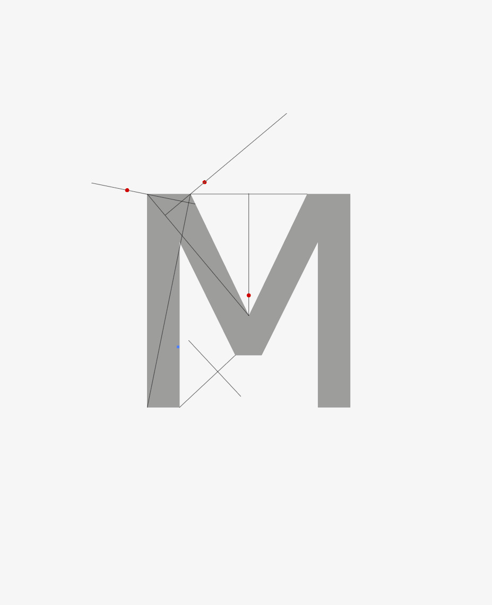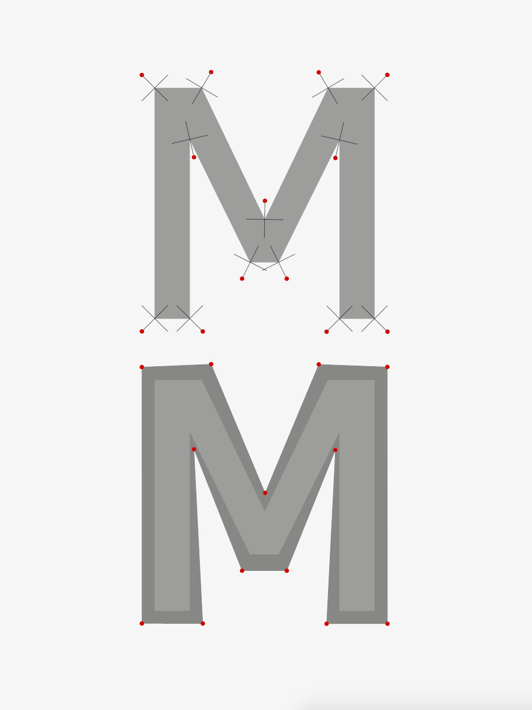Drawings made by Laura Savignac to help me find a method

We now have points instead of curves, and a method, we'll proceed to do this scale-up algorithm. Or will we ?

    [
      {
        "x": 50,
        "y": 50
      },
      {
        "x": 49.69388000000001,
        "y": 49.982160000000015
      },
      {
        "x": 49.423040000000015,
        "y": 49.92928000000001
      },
      {
        "x": 49.18675999999999,
        "y": 49.842319999999994
      },
      {
        "x": 48.98432000000001,
        "y": 49.72224000000001
      },
      {
        "x": 48.815,
        "y": 49.57
      },
      {
        "x": 48.678079999999994,
        "y": 49.386559999999996
      },
      {
        "x": 48.57284,
        "y": 49.17287999999999
      },
      {
        "x": 48.49856,
        "y": 48.92992
      },
      {
        "x": 48.45452,
        "y": 48.65864
      },
      {
        "x": 48.44,
        "y": 48.36
      },
      {
        "x": 48.57104000000001,
        "y": 47.31980000000001
      },
      {
        "x": 48.92672,
        "y": 46.240000000000016
      },
      {
        "x": 49.45088,
        "y": 45.1218
      },
      {
        "x": 50.087360000000004,
        "y": 43.9664
      },
      {
        "x": 50.78,
        "y": 42.775
      },
      {
        "x": 51.47263999999999,
        "y": 41.54879999999999
      },
      {
        "x": 52.10911999999999,
        "y": 40.289
      },
      {
        "x": 52.63328,
        "y": 38.9968
      },
      {
        "x": 52.98896,
        "y": 37.6734
      },
      {
        "x": 53.12,
        "y": 36.32
      },
      {
        "x": 53.0644,
        "y": 35.46444000000001
      },
      {
        "x": 52.90080000000001,
        "y": 34.69792
      },
      {
        "x": 52.63399999999999,
        "y": 34.02068
      },
      {
        "x": 52.268800000000006,
        "y": 33.43296000000001
      },
      {
        "x": 51.80999999999999,
        "y": 32.935
      },
      {
        "x": 51.26239999999999,
        "y": 32.52704
      },
      {
        "x": 50.630799999999994,
        "y": 32.20932
      },
      {
        "x": 49.92,
        "y": 31.982080000000003
      },
      {
        "x": 49.1348,
        "y": 31.845560000000003
      },
      {
        "x": 48.28,
        "y": 31.8
      },
      {
        "x": 47.22632000000001,
        "y": 31.847160000000006
      },
      {
        "x": 46.176960000000015,
        "y": 31.999680000000012
      },
      {
        "x": 45.13144,
        "y": 32.274119999999996
      },
      {
        "x": 44.08928,
        "y": 32.68704
      },
      {
        "x": 43.05,
        "y": 33.255
      },
      {
        "x": 42.013119999999994,
        "y": 33.99456
      },
      {
        "x": 40.97816,
        "y": 34.92228
      },
      {
        "x": 39.94464000000001,
        "y": 36.05472
      },
      {
        "x": 38.91208,
        "y": 37.40844
      },
      {
        "x": 37.88,
        "y": 39
      },
      {
        "x": 37.32,
        "y": 39
      },
      {
        "x": 37.92288,
        "y": 37.59316000000001
      },
      {
        "x": 38.48064000000001,
        "y": 36.25088000000001
      },
      {
        "x": 38.98895999999999,
        "y": 34.97052
      },
      {
        "x": 39.44352000000001,
        "y": 33.74944000000001
      },
      {
        "x": 39.839999999999996,
        "y": 32.585
      },
      {
        "x": 40.17407999999999,
        "y": 31.47456
      },
      {
        "x": 40.44144,
        "y": 30.41548
      },
      {
        "x": 40.63776,
        "y": 29.405120000000004
      },
      {
        "x": 40.75872,
        "y": 28.44084
      },
      {
        "x": 40.8,
        "y": 27.52
      },
      {
        "x": 40.76192,
        "y": 26.881600000000002
      },
      {
        "x": 40.64896000000001,
        "y": 26.31040000000001
      },
      {
        "x": 40.46303999999999,
        "y": 25.806399999999996
      },
      {
        "x": 40.20608,
        "y": 25.369600000000002
      },
      {
        "x": 39.879999999999995,
        "y": 25
      },
      {
        "x": 39.48671999999999,
        "y": 24.697599999999998
      },
      {
        "x": 39.02816,
        "y": 24.462400000000002
      },
      {
        "x": 38.50624,
        "y": 24.294400000000003
      },
      {
        "x": 37.92287999999999,
        "y": 24.193600000000004
      },
      {
        "x": 37.279999999999994,
        "y": 24.16
      },
      {
        "x": 36.8216,
        "y": 24.173000000000005
      },
      {
        "x": 36.3584,
        "y": 24.21120000000001
      },
      {
        "x": 35.890399999999985,
        "y": 24.273399999999995
      },
      {
        "x": 35.41759999999999,
        "y": 24.358400000000007
      },
      {
        "x": 34.94,
        "y": 24.465
      },
      {
        "x": 34.45759999999999,
        "y": 24.592
      },
      {
        "x": 33.9704,
        "y": 24.7382
      },
      {
        "x": 33.47839999999999,
        "y": 24.9024
      },
      {
        "x": 32.9816,
        "y": 25.0834
      },
      {
        "x": 32.48,
        "y": 25.28
      },
      {
        "x": 32.58560000000001,
        "y": 25.48620000000001
      },
      {
        "x": 32.686400000000006,
        "y": 25.696000000000005
      },
      {
        "x": 32.782399999999996,
        "y": 25.9082
      },
      {
        "x": 32.873599999999996,
        "y": 26.121600000000004
      },
      {
        "x": 32.959999999999994,
        "y": 26.335
      },
      {
        "x": 33.041599999999995,
        "y": 26.547199999999997
      },
      {
        "x": 33.118399999999994,
        "y": 26.756999999999998
      },
      {
        "x": 33.1904,
        "y": 26.9632
      },
      {
        "x": 33.2576,
        "y": 27.1646
      },
      {
        "x": 33.32,
        "y": 27.36
      },
      {
        "x": 33.750240000000005,
        "y": 27.165640000000003
      },
      {
        "x": 34.15552,
        "y": 26.990720000000007
      },
      {
        "x": 34.53967999999999,
        "y": 26.83548
      },
      {
        "x": 34.90656,
        "y": 26.700160000000004
      },
      {
        "x": 35.26,
        "y": 26.585
      },
      {
        "x": 35.60384,
        "y": 26.49024
      },
      {
        "x": 35.941919999999996,
        "y": 26.416119999999996
      },
      {
        "x": 36.27808,
        "y": 26.362880000000004
      },
      {
        "x": 36.61616,
        "y": 26.33076
      },
      {
        "x": 36.96,
        "y": 26.32
      },
      {
        "x": 37.32256000000002,
        "y": 26.337960000000002
      },
      {
        "x": 37.64288000000001,
        "y": 26.39168000000001
      },
      {
        "x": 37.92192,
        "y": 26.480919999999998
      },
      {
        "x": 38.16064000000001,
        "y": 26.60544
      },
      {
        "x": 38.36000000000001,
        "y": 26.765000000000004
      },
      {
        "x": 38.52096,
        "y": 26.95936
      },
      {
        "x": 38.64448,
        "y": 27.18828
      },
      {
        "x": 38.73152,
        "y": 27.451520000000002
      },
      {
        "x": 38.78304,
        "y": 27.74884
      },
      {
        "x": 38.800000000000004,
        "y": 28.080000000000002
      },
      {
        "x": 38.70236000000001,
        "y": 29.106480000000005
      },
      {
        "x": 38.41728000000002,
        "y": 30.43104000000001
      },
      {
        "x": 37.956520000000005,
        "y": 32.04936
      },
      {
        "x": 37.33184000000001,
        "y": 33.95712
      },
      {
        "x": 36.55500000000001,
        "y": 36.15
      },
      {
        "x": 35.63776,
        "y": 38.62368
      },
      {
        "x": 34.59188,
        "y": 41.37384
      },
      {
        "x": 33.429120000000005,
        "y": 44.39616
      },
      {
        "x": 32.16124000000001,
        "y": 47.686319999999995
      },
      {
        "x": 30.800000000000004,
        "y": 51.24
      },
      {
        "x": 31.03528000000001,
        "y": 51.27612000000002
      },
      {
        "x": 31.26144000000001,
        "y": 51.312960000000025
      },
      {
        "x": 31.47896,
        "y": 51.35123999999999
      },
      {
        "x": 31.68832,
        "y": 51.39168000000001
      },
      {
        "x": 31.890000000000004,
        "y": 51.435
      },
      {
        "x": 32.08448,
        "y": 51.48192
      },
      {
        "x": 32.272240000000004,
        "y": 51.533159999999995
      },
      {
        "x": 32.45376,
        "y": 51.58944
      },
      {
        "x": 32.62952,
        "y": 51.65147999999999
      },
      {
        "x": 32.800000000000004,
        "y": 51.72
      },
      {
        "x": 32.92,
        "y": 51.76
      },
      {
        "x": 34.61864000000001,
        "y": 47.49436000000001
      },
      {
        "x": 36.29952000000001,
        "y": 43.94368000000001
      },
      {
        "x": 37.952079999999995,
        "y": 41.04532
      },
      {
        "x": 39.565760000000004,
        "y": 38.73664
      },
      {
        "x": 41.13000000000001,
        "y": 36.955
      },
      {
        "x": 42.63424,
        "y": 35.63776
      },
      {
        "x": 44.06792,
        "y": 34.72228
      },
      {
        "x": 45.420480000000005,
        "y": 34.145920000000004
      },
      {
        "x": 46.681360000000005,
        "y": 33.84604
      },
      {
        "x": 47.84,
        "y": 33.76
      },
      {
        "x": 48.38196000000001,
        "y": 33.78432000000001
      },
      {
        "x": 48.878080000000026,
        "y": 33.858560000000004
      },
      {
        "x": 49.32572,
        "y": 33.98464
      },
      {
        "x": 49.72224000000001,
        "y": 34.16448
      },
      {
        "x": 50.065000000000005,
        "y": 34.4
      },
      {
        "x": 50.35136,
        "y": 34.69311999999999
      },
      {
        "x": 50.578680000000006,
        "y": 35.045759999999994
      },
      {
        "x": 50.74432,
        "y": 35.45984
      },
      {
        "x": 50.84564,
        "y": 35.93728
      },
      {
        "x": 50.88,
        "y": 36.48
      },
      {
        "x": 50.74896000000001,
        "y": 37.5536
      },
      {
        "x": 50.39328000000002,
        "y": 38.66080000000001
      },
      {
        "x": 49.869119999999995,
        "y": 39.799199999999985
      },
      {
        "x": 49.23264,
        "y": 40.96640000000001
      },
      {
        "x": 48.54,
        "y": 42.16
      },
      {
        "x": 47.84736,
        "y": 43.377599999999994
      },
      {
        "x": 47.21088,
        "y": 44.6168
      },
      {
        "x": 46.68672,
        "y": 45.8752
      },
      {
        "x": 46.33104,
        "y": 47.150400000000005
      },
      {
        "x": 46.2,
        "y": 48.44
      },
      {
        "x": 46.247760000000014,
        "y": 49.13148000000001
      },
      {
        "x": 46.38528000000002,
        "y": 49.74304000000001
      },
      {
        "x": 46.60392,
        "y": 50.27635999999999
      },
      {
        "x": 46.89504000000001,
        "y": 50.73312000000001
      },
      {
        "x": 47.25000000000001,
        "y": 51.114999999999995
      },
      {
        "x": 47.66016,
        "y": 51.42367999999999
      },
      {
        "x": 48.11688,
        "y": 51.66083999999999
      },
      {
        "x": 48.61152,
        "y": 51.82816
      },
      {
        "x": 49.13544,
        "y": 51.92732
      },
      {
        "x": 49.68,
        "y": 51.96
      },
      {
        "x": 50.397800000000004,
        "y": 51.91368
      },
      {
        "x": 51.06880000000001,
        "y": 51.776640000000015
      },
      {
        "x": 51.70139999999999,
        "y": 51.551759999999994
      },
      {
        "x": 52.304,
        "y": 51.24192
      },
      {
        "x": 52.885,
        "y": 50.849999999999994
      },
      {
        "x": 53.45279999999999,
        "y": 50.378879999999995
      },
      {
        "x": 54.01579999999999,
        "y": 49.83143999999999
      },
      {
        "x": 54.5824,
        "y": 49.21056
      },
      {
        "x": 55.161,
        "y": 48.519119999999994
      },
      {
        "x": 55.76,
        "y": 47.76
      },
      {
        "x": 55.55312000000001,
        "y": 47.620480000000015
      },
      {
        "x": 55.36256000000001,
        "y": 47.48864000000001
      },
      {
        "x": 55.18543999999999,
        "y": 47.36255999999999
      },
      {
        "x": 55.01888,
        "y": 47.240320000000004
      },
      {
        "x": 54.86,
        "y": 47.120000000000005
      },
      {
        "x": 54.70591999999999,
        "y": 46.99967999999999
      },
      {
        "x": 54.55376,
        "y": 46.87744
      },
      {
        "x": 54.40064,
        "y": 46.751360000000005
      },
      {
        "x": 54.24368,
        "y": 46.61952
      },
      {
        "x": 54.08,
        "y": 46.48
      },
      {
        "x": 53.66768,
        "y": 47.132600000000004
      },
      {
        "x": 53.267840000000014,
        "y": 47.72160000000001
      },
      {
        "x": 52.87615999999999,
        "y": 48.245799999999996
      },
      {
        "x": 52.48832,
        "y": 48.70400000000001
      },
      {
        "x": 52.099999999999994,
        "y": 49.095
      },
      {
        "x": 51.70688,
        "y": 49.41759999999999
      },
      {
        "x": 51.30463999999999,
        "y": 49.67059999999999
      },
      {
        "x": 50.88896,
        "y": 49.8528
      },
      {
        "x": 50.45552,
        "y": 49.963
      },
      {
        "x": 50,
        "y": 50
      }
    ]

Point fog rendering, and a test of an intuition about path segment normals.

It happens that the problem I'm trying to solve is really non-trivial. With a bit more research (and stumbling on the right terms), what I'm trying to solve is called "outward polygon offsetting". [A stackoverflow answer](https://stackoverflow.com/questions/1109536/an-algorithm-for-inflating-deflating-offsetting-buffering-polygons) gave me some direction. [This survey gave a nice answer too.](http://fcacciola.50webs.com/Offseting%20Methods.htm) What if a simpler strategy could work ? I could reimplement a C++/C#/Delphi library called [Clipper](http://www.angusj.com/delphi/clipper.php), or find a "nice enough" heuristic. I could copy-paste a stroke algorithm and take its output before rendering. Let's dive into Inkscape sources. Or into Clipper, and extract the subroutine and its dependencies.

For now, let's test with a library found on npm, [polygon-offset](https://github.com/w8r/polygon-offset). It seems nice enough to be free of assumptions about how you describe a polygon, and is satisfied with an array of points.

    [
      [
        50,
        50
      ],
      [
        49.69388000000001,
        49.982160000000015
      ],
      [
        49.423040000000015,
        49.92928000000001
      ],
      [
        49.18675999999999,
        49.842319999999994
      ],
      [
        48.98432000000001,
        49.72224000000001
      ],
      [
        48.815,
        49.57
      ],
      [
        48.678079999999994,
        49.386559999999996
      ],
      [
        48.57284,
        49.17287999999999
      ],
      [
        48.49856,
        48.92992
      ],
      [
        48.45452,
        48.65864
      ],
      [
        48.44,
        48.36
      ],
      [
        48.57104000000001,
        47.31980000000001
      ],
      [
        48.92672,
        46.240000000000016
      ],
      [
        49.45088,
        45.1218
      ],
      [
        50.087360000000004,
        43.9664
      ],
      [
        50.78,
        42.775
      ],
      [
        51.47263999999999,
        41.54879999999999
      ],
      [
        52.10911999999999,
        40.289
      ],
      [
        52.63328,
        38.9968
      ],
      [
        52.98896,
        37.6734
      ],
      [
        53.12,
        36.32
      ],
      [
        53.0644,
        35.46444000000001
      ],
      [
        52.90080000000001,
        34.69792
      ],
      [
        52.63399999999999,
        34.02068
      ],
      [
        52.268800000000006,
        33.43296000000001
      ],
      [
        51.80999999999999,
        32.935
      ],
      [
        51.26239999999999,
        32.52704
      ],
      [
        50.630799999999994,
        32.20932
      ],
      [
        49.92,
        31.982080000000003
      ],
      [
        49.1348,
        31.845560000000003
      ],
      [
        48.28,
        31.8
      ],
      [
        47.22632000000001,
        31.847160000000006
      ],
      [
        46.176960000000015,
        31.999680000000012
      ],
      [
        45.13144,
        32.274119999999996
      ],
      [
        44.08928,
        32.68704
      ],
      [
        43.05,
        33.255
      ],
      [
        42.013119999999994,
        33.99456
      ],
      [
        40.97816,
        34.92228
      ],
      [
        39.94464000000001,
        36.05472
      ],
      [
        38.91208,
        37.40844
      ],
      [
        37.88,
        39
      ],
      [
        37.32,
        39
      ],
      [
        37.92288,
        37.59316000000001
      ],
      [
        38.48064000000001,
        36.25088000000001
      ],
      [
        38.98895999999999,
        34.97052
      ],
      [
        39.44352000000001,
        33.74944000000001
      ],
      [
        39.839999999999996,
        32.585
      ],
      [
        40.17407999999999,
        31.47456
      ],
      [
        40.44144,
        30.41548
      ],
      [
        40.63776,
        29.405120000000004
      ],
      [
        40.75872,
        28.44084
      ],
      [
        40.8,
        27.52
      ],
      [
        40.76192,
        26.881600000000002
      ],
      [
        40.64896000000001,
        26.31040000000001
      ],
      [
        40.46303999999999,
        25.806399999999996
      ],
      [
        40.20608,
        25.369600000000002
      ],
      [
        39.879999999999995,
        25
      ],
      [
        39.48671999999999,
        24.697599999999998
      ],
      [
        39.02816,
        24.462400000000002
      ],
      [
        38.50624,
        24.294400000000003
      ],
      [
        37.92287999999999,
        24.193600000000004
      ],
      [
        37.279999999999994,
        24.16
      ],
      [
        36.8216,
        24.173000000000005
      ],
      [
        36.3584,
        24.21120000000001
      ],
      [
        35.890399999999985,
        24.273399999999995
      ],
      [
        35.41759999999999,
        24.358400000000007
      ],
      [
        34.94,
        24.465
      ],
      [
        34.45759999999999,
        24.592
      ],
      [
        33.9704,
        24.7382
      ],
      [
        33.47839999999999,
        24.9024
      ],
      [
        32.9816,
        25.0834
      ],
      [
        32.48,
        25.28
      ],
      [
        32.58560000000001,
        25.48620000000001
      ],
      [
        32.686400000000006,
        25.696000000000005
      ],
      [
        32.782399999999996,
        25.9082
      ],
      [
        32.873599999999996,
        26.121600000000004
      ],
      [
        32.959999999999994,
        26.335
      ],
      [
        33.041599999999995,
        26.547199999999997
      ],
      [
        33.118399999999994,
        26.756999999999998
      ],
      [
        33.1904,
        26.9632
      ],
      [
        33.2576,
        27.1646
      ],
      [
        33.32,
        27.36
      ],
      [
        33.750240000000005,
        27.165640000000003
      ],
      [
        34.15552,
        26.990720000000007
      ],
      [
        34.53967999999999,
        26.83548
      ],
      [
        34.90656,
        26.700160000000004
      ],
      [
        35.26,
        26.585
      ],
      [
        35.60384,
        26.49024
      ],
      [
        35.941919999999996,
        26.416119999999996
      ],
      [
        36.27808,
        26.362880000000004
      ],
      [
        36.61616,
        26.33076
      ],
      [
        36.96,
        26.32
      ],
      [
        37.32256000000002,
        26.337960000000002
      ],
      [
        37.64288000000001,
        26.39168000000001
      ],
      [
        37.92192,
        26.480919999999998
      ],
      [
        38.16064000000001,
        26.60544
      ],
      [
        38.36000000000001,
        26.765000000000004
      ],
      [
        38.52096,
        26.95936
      ],
      [
        38.64448,
        27.18828
      ],
      [
        38.73152,
        27.451520000000002
      ],
      [
        38.78304,
        27.74884
      ],
      [
        38.800000000000004,
        28.080000000000002
      ],
      [
        38.70236000000001,
        29.106480000000005
      ],
      [
        38.41728000000002,
        30.43104000000001
      ],
      [
        37.956520000000005,
        32.04936
      ],
      [
        37.33184000000001,
        33.95712
      ],
      [
        36.55500000000001,
        36.15
      ],
      [
        35.63776,
        38.62368
      ],
      [
        34.59188,
        41.37384
      ],
      [
        33.429120000000005,
        44.39616
      ],
      [
        32.16124000000001,
        47.686319999999995
      ],
      [
        30.800000000000004,
        51.24
      ],
      [
        31.03528000000001,
        51.27612000000002
      ],
      [
        31.26144000000001,
        51.312960000000025
      ],
      [
        31.47896,
        51.35123999999999
      ],
      [
        31.68832,
        51.39168000000001
      ],
      [
        31.890000000000004,
        51.435
      ],
      [
        32.08448,
        51.48192
      ],
      [
        32.272240000000004,
        51.533159999999995
      ],
      [
        32.45376,
        51.58944
      ],
      [
        32.62952,
        51.65147999999999
      ],
      [
        32.800000000000004,
        51.72
      ],
      [
        32.92,
        51.76
      ],
      [
        34.61864000000001,
        47.49436000000001
      ],
      [
        36.29952000000001,
        43.94368000000001
      ],
      [
        37.952079999999995,
        41.04532
      ],
      [
        39.565760000000004,
        38.73664
      ],
      [
        41.13000000000001,
        36.955
      ],
      [
        42.63424,
        35.63776
      ],
      [
        44.06792,
        34.72228
      ],
      [
        45.420480000000005,
        34.145920000000004
      ],
      [
        46.681360000000005,
        33.84604
      ],
      [
        47.84,
        33.76
      ],
      [
        48.38196000000001,
        33.78432000000001
      ],
      [
        48.878080000000026,
        33.858560000000004
      ],
      [
        49.32572,
        33.98464
      ],
      [
        49.72224000000001,
        34.16448
      ],
      [
        50.065000000000005,
        34.4
      ],
      [
        50.35136,
        34.69311999999999
      ],
      [
        50.578680000000006,
        35.045759999999994
      ],
      [
        50.74432,
        35.45984
      ],
      [
        50.84564,
        35.93728
      ],
      [
        50.88,
        36.48
      ],
      [
        50.74896000000001,
        37.5536
      ],
      [
        50.39328000000002,
        38.66080000000001
      ],
      [
        49.869119999999995,
        39.799199999999985
      ],
      [
        49.23264,
        40.96640000000001
      ],
      [
        48.54,
        42.16
      ],
      [
        47.84736,
        43.377599999999994
      ],
      [
        47.21088,
        44.6168
      ],
      [
        46.68672,
        45.8752
      ],
      [
        46.33104,
        47.150400000000005
      ],
      [
        46.2,
        48.44
      ],
      [
        46.247760000000014,
        49.13148000000001
      ],
      [
        46.38528000000002,
        49.74304000000001
      ],
      [
        46.60392,
        50.27635999999999
      ],
      [
        46.89504000000001,
        50.73312000000001
      ],
      [
        47.25000000000001,
        51.114999999999995
      ],
      [
        47.66016,
        51.42367999999999
      ],
      [
        48.11688,
        51.66083999999999
      ],
      [
        48.61152,
        51.82816
      ],
      [
        49.13544,
        51.92732
      ],
      [
        49.68,
        51.96
      ],
      [
        50.397800000000004,
        51.91368
      ],
      [
        51.06880000000001,
        51.776640000000015
      ],
      [
        51.70139999999999,
        51.551759999999994
      ],
      [
        52.304,
        51.24192
      ],
      [
        52.885,
        50.849999999999994
      ],
      [
        53.45279999999999,
        50.378879999999995
      ],
      [
        54.01579999999999,
        49.83143999999999
      ],
      [
        54.5824,
        49.21056
      ],
      [
        55.161,
        48.519119999999994
      ],
      [
        55.76,
        47.76
      ],
      [
        55.55312000000001,
        47.620480000000015
      ],
      [
        55.36256000000001,
        47.48864000000001
      ],
      [
        55.18543999999999,
        47.36255999999999
      ],
      [
        55.01888,
        47.240320000000004
      ],
      [
        54.86,
        47.120000000000005
      ],
      [
        54.70591999999999,
        46.99967999999999
      ],
      [
        54.55376,
        46.87744
      ],
      [
        54.40064,
        46.751360000000005
      ],
      [
        54.24368,
        46.61952
      ],
      [
        54.08,
        46.48
      ],
      [
        53.66768,
        47.132600000000004
      ],
      [
        53.267840000000014,
        47.72160000000001
      ],
      [
        52.87615999999999,
        48.245799999999996
      ],
      [
        52.48832,
        48.70400000000001
      ],
      [
        52.099999999999994,
        49.095
      ],
      [
        51.70688,
        49.41759999999999
      ],
      [
        51.30463999999999,
        49.67059999999999
      ],
      [
        50.88896,
        49.8528
      ],
      [
        50.45552,
        49.963
      ],
      [
        50,
        50
      ]
    ]

We have an offset outline, and implementing this by hand would have been a nightmare. Can we make this 3d ? I'll take [This example from three.js](https://threejs.org/examples/?q=conv#webgl_geometry_convex) as a starting point. What was meant to be an "implement everything" exercise turns more and more to a "cobble stuff together" exercise. But I now have a nice stack of papers to read. Clicking "download" on three.js homepage yields a 250MB zip file, I should have known what territory I was stepping into.

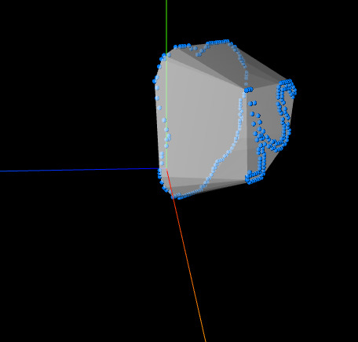Three.js's example adapted with current path & offset data.

This test, an adaptation of THREE.js's example "ConvexGeometry", reveals that a naïve culling approach won't be enough: our polygons are concave.

Let's dive into [polygon triangulation](https://en.wikipedia.org/wiki/Polygon_triangulation), I guess ? There are naïve algorithms available, and I'll then proceed to implement stitching between the original and offset shape.

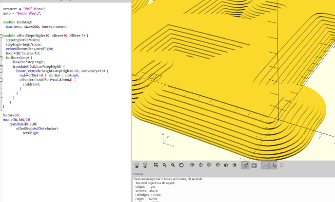An adaptation of a script found on the OPENSCAD forums. I can't find the link back, email me if you're the author !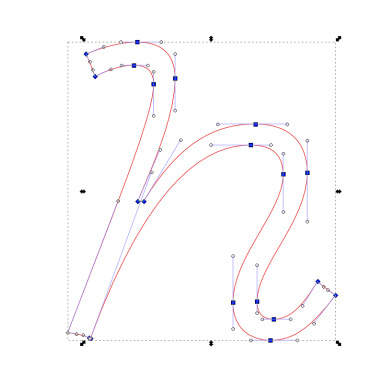my starting point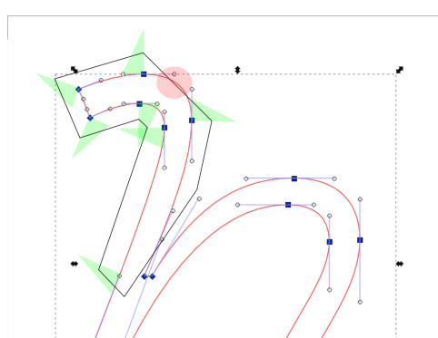I should have known before starting, with those manual tests, that my naïve approach wasn't going to cut it.

Or, let's develop a manual process with straight guidelines.

Thanks for reading !